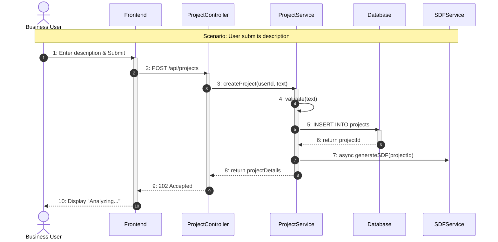
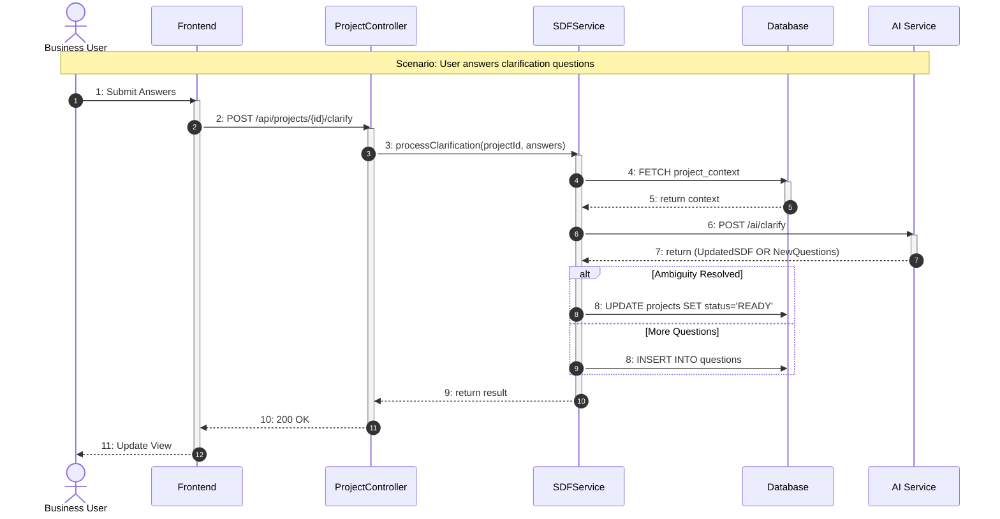
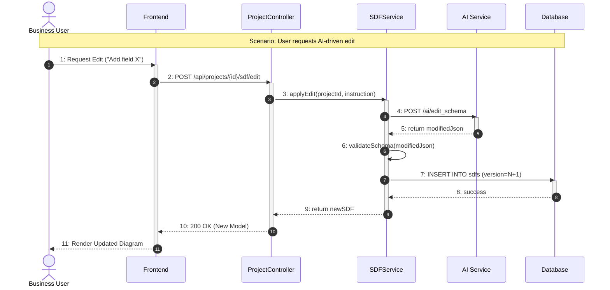
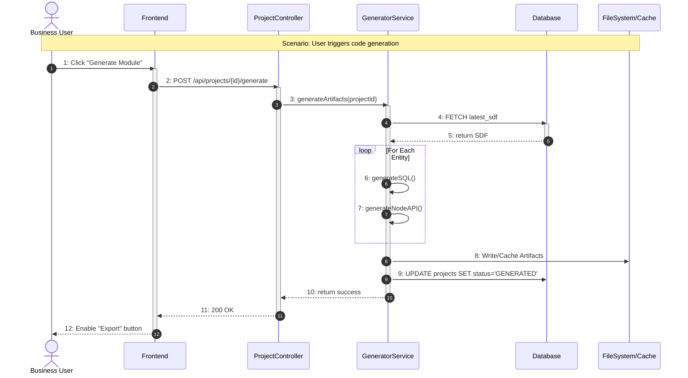
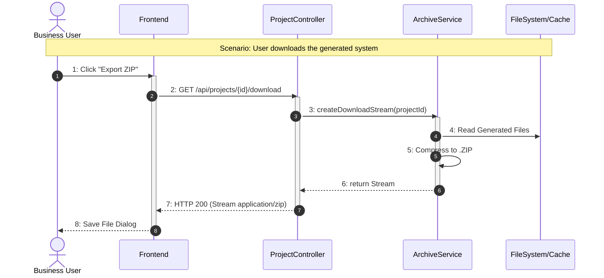

# 3.2 Process View

This section details the **Use Case Realization** for the five Use Cases defined in the First Increment. For each use case, we provide a textual explanation of the object interactions and a **UML Communication Diagram** (visualized here using message-sequence notation) to illustrate the dynamic behavior of the system.

## 3.2.1 Use Case 1: Submit Business Description

**Use Case Realization:**
The realization of this use case initiates the project lifecycle. The **Business User** interacts with the **Frontend** (Project Wizard) to input their natural language description. The **Frontend** sends a POST request to the **ProjectController**. The controller delegates the creation logic to the **ProjectService**, which persists a new `Project` entity in the **Database** with a 'DRAFT' or 'ANALYZING' status. Crucially, the **ProjectService** then triggers an asynchronous call to the **SDFService** to begin AI processing without blocking the user interface, returning an immediate "Accepted" status to the user.

**UML Communication Diagram:**

---

## 3.2.2 Use Case 2: Clarify Requirements

**Use Case Realization:**
This use case realizes the interactive clarification loop. When the **User** submits answers to clarification questions via the **Frontend**, the **ProjectController** receives the payload. It invokes the **SDFService**, which retrieves the current project context from the **Database**. The **SDFService** then acts as a client to the external **AI Service** (AI Gateway), sending the context and answers. The AI determines if further ambiguity exists. If so, new questions are generated; if not, the SDF is finalized. The system updates the project state accordingly.

**UML Communication Diagram:**

---

## 3.2.3 Use Case 3: Review & Edit SDF

**Use Case Realization:**
This use case allows the user to modify the generated data model. The **User** issues an edit command (e.g., "Add an expiry date field") via the **Frontend**. The **ProjectController** routes this to the **SDFService**. The service sends a "Modification Prompt" to the **AI Service**, which returns a modified JSON schema. The **SDFService** performs strict schema validation on this JSON. If valid, it persists the new schema as a new version in the **Database** (table `sdfs`), maintaining a history of changes.

**UML Communication Diagram:**

---

## 3.2.4 Use Case 4: Generate Inventory Module

**Use Case Realization:**
This use case handles the transformation of the metadata (SDF) into executable code. The **User** clicks "Generate" on the **Frontend**. The **ProjectController** calls the **GeneratorService**. This service fetches the "Locked/Approved" SDF from the **Database**. It then iterates through the entities defined in the SDF, using internal templates to synthesize SQL `CREATE TABLE` scripts, Node.js API routes, and React UI components. These artifacts are stored or cached for download, and the project status is updated to 'GENERATED'.

**UML Communication Diagram:**

---

## 3.2.5 Use Case 5: Export System

**Use Case Realization:**
This use case realizes the delivery of the product. The **User** requests a download via the **Frontend**. The **ProjectController** invokes the **ArchiveService**. This service retrieves the generated files (SQL, JS, etc.) from the **FileSystem/Cache**, bundles them into a ZIP archive using a compression library, and returns a binary stream. The **ProjectController** pipes this stream to the response with the appropriate MIME type, triggering a file download in the user's browser.

**UML Communication Diagram:**

