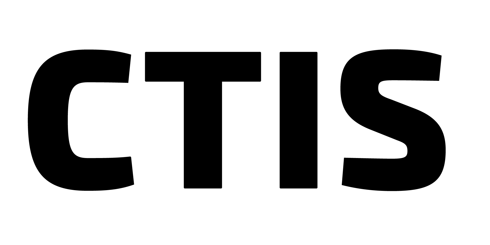

<p align="center">
  <picture>
    <source media="(prefers-color-scheme: dark)" srcset="CTISLogoDarkMode.png">
    
  </picture>
</p>

<h1 align="center">CustomERP</h1>

<p align="center">
  <em>An AI-driven assembly engine that turns a business description into a runnable, custom ERP.</em>
</p>

<p align="center">
  
  
  
</p>

---

## What it is

CustomERP is **not** an AI code generator. It's an **assembler**.

1. The user describes their business in plain English (or Turkish).
2. The **AI Gateway** (Gemini / Azure OpenAI) translates that into a structured **System Definition File (SDF)** — a JSON spec of entities, fields, relations, and module configuration.
3. The **Assembler** validates the SDF and stitches together pre-built, tested code from the **Brick Library** (mixins, templates, providers).
4. The output is a runnable ERP — Node.js + React + SQLite (standalone) or PostgreSQL — packaged as a Docker container or standalone executable.

> **Architect / Builder split.** AI is the architect (designs the blueprint), the platform is the builder (assembles pre-fabricated parts). This keeps generated code deterministic, reviewable, and free of hallucinated logic.

---

## Architecture at a glance

```
┌───────────────┐  describe   ┌────────────────┐  SDF   ┌────────────────┐
│  Frontend SPA │────────────▶│   AI Gateway   │───────▶│   Assembler    │
│ (React/Vite)  │             │   (FastAPI)    │        │   (Node.js)    │
└──────┬────────┘             └────────────────┘        └────────┬───────┘
       │                                                         │
       │ REST                                            assembles│
       ▼                                                         ▼
┌───────────────┐                                       ┌────────────────┐
│Platform Backend│   PostgreSQL: users, projects,       │ Generated ERP  │
│   (Express)   │◀──── SDFs, conversations, ──────────▶│  (zip / exe /  │
│               │      training data                    │   docker img)  │
└───────────────┘                                       └────────────────┘
```

Four codebases live under [`platform/`](platform/):

| Subsystem | Stack | Role |
|---|---|---|
| [`platform/frontend`](platform/frontend) | React 18 + Vite + Tailwind + i18next | Dashboard, project workspace, SDF editor, live preview |
| [`platform/backend`](platform/backend) | Node.js 20 + Express 5 + PostgreSQL 16 | Auth, project lifecycle, SDF persistence, AI proxy, preview routing |
| [`platform/ai-gateway`](platform/ai-gateway) | Python 3.11 + FastAPI + Pydantic | NL → SDF pipeline (precheck → analyze → clarify → finalize → edit) |
| [`platform/assembler`](platform/assembler) | Node.js + Handlebars | Reads SDF, composes bricks, emits backend + frontend + packaging |

Plus the [`brick-library/`](brick-library) — the pre-built "parts" the assembler stitches together.

For the full breakdown see [docs/ARCHITECTURE.md](docs/ARCHITECTURE.md).

---

## Modules currently supported

| Module | Status | Highlights |
|---|---|---|
| **Inventory** | ✅ | Receive / Issue / Transfer / Adjust wizards, low-stock alerts, expiry tracking, cycle counts, reservations, QR codes, time-travel diffs |
| **Invoice** | ✅ | Lifecycle states, calculation engine, payments, notes, transaction safety, PDF/print |
| **HR** | ✅ | Employees, leave balance & approvals, attendance/timesheets, compensation ledger, user-employee linking |
| **Cross-cutting** | ✅ | RBAC, audit trail, CSV import, i18n (English + Turkish), relation rule runner |

Module logic lives as **mixins** under [`brick-library/backend-bricks/mixins/`](brick-library/backend-bricks/mixins) and pre-built UI under [`brick-library/frontend-bricks/`](brick-library/frontend-bricks).

---

## Quick start (Docker)

### Prerequisites
- Docker Desktop 24+
- A Google AI API key ([aistudio.google.com](https://aistudio.google.com/app/apikey)) **or** Azure OpenAI credentials

### Run it

```bash
git clone https://github.com/CustomERP411/CustomERP.git
cd CustomERP

cp .env.example .env
# Edit .env — set GOOGLE_AI_API_KEY (or Azure OpenAI vars)

docker compose up -d
```

| Service | URL |
|---|---|
| Frontend | http://localhost:5173 |
| Backend API | http://localhost:3000 |
| AI Gateway | http://localhost:8000 |
| pgAdmin (optional) | http://localhost:5050 |

Run `make help` (or `scripts/dev.ps1 help` on Windows) for all dev commands.

### First-time data seed

```bash
# Linux / macOS
./scripts/seed.sh

# Windows
.\scripts\seed.ps1
```

Details: [scripts/SEEDING.md](scripts/SEEDING.md).

---

## Running without Docker

You'll need Node.js 20, Python 3.11, and PostgreSQL 16 (or just `docker compose up postgres -d` for the DB).

```bash
# Terminal 1 — backend
cd platform/backend && npm install && npm run dev

# Terminal 2 — frontend
cd platform/frontend && npm install && npm run dev

# Terminal 3 — AI gateway
cd platform/ai-gateway
python -m venv venv && source venv/bin/activate   # Windows: .\venv\Scripts\Activate
pip install -r requirements.txt
uvicorn src.main:app --reload --port 8000
```

---

## Repository layout

```
CustomERP/
├── platform/
│   ├── frontend/        React/Vite dashboard
│   ├── backend/         Express API (auth, projects, SDF, preview proxy)
│   ├── ai-gateway/      FastAPI service (NL → SDF)
│   └── assembler/       SDF → ERP code generator
│
├── brick-library/
│   ├── backend-bricks/  core, mixins (Inventory/Invoice/HR), repositories, RBAC
│   ├── frontend-bricks/ DynamicForm, modules UI, layouts
│   └── templates/       standalone packaging templates
│
├── docs/                Living developer docs (overview, architecture, testing)
├── Documents/           Formal academic deliverables (SRS, SPMP, SDD)
├── diagrams/            UML diagrams (use cases, sequence, class, activity)
├── nginx/               Production reverse proxy config
├── scripts/             dev / deploy / seed / backup scripts
├── mockfiller/          SDF mock-data generators
├── test/                Smoke + integration tests + sample SDFs
├── tests/UnitTests/     Per-UC unit test suite (Jest)
│
├── Blueprint.md             Authoritative architecture reference
├── SDF_REFERENCE.md         Full SDF schema spec
├── module_coherence_design.md   Cross-module invariant design
├── observed_issues_grouping.md  Bug triage log
├── smb_owner_examples.md        SMB owner persona / use-case examples
│
├── docker-compose.yml       Dev environment
├── docker-compose.prod.yml  Production environment
├── nginx/nginx.conf
├── Makefile                 Common commands (Linux/macOS)
└── scripts/dev.{sh,ps1}     Common commands (cross-platform)
```

---

## Documentation

| Doc | Purpose |
|---|---|
| [README.md](README.md) | This file — orientation + quick start |
| [docs/ARCHITECTURE.md](docs/ARCHITECTURE.md) | System map: subsystems, data flow, brick library, DB schema |
| [docs/GENERATOR.md](docs/GENERATOR.md) | Deep dive: how the assembler turns an SDF into a runnable ERP |
| [docs/overview.md](docs/overview.md) | End-to-end conceptual overview (UC-1 → UC-7) |
| [CONTRIBUTING.md](CONTRIBUTING.md) | Dev setup, code style, branch workflow, ownership |
| [Blueprint.md](Blueprint.md) | Deep technical reference (assembly logic, generators) |
| [SDF_REFERENCE.md](SDF_REFERENCE.md) | Full SDF JSON schema |
| [docs/customerp_use_cases.md](docs/customerp_use_cases.md) | Use case catalog |
| [docs/prompt_expectations.md](docs/prompt_expectations.md) | AI prompt design contract |
| [docs/testing_guide.md](docs/testing_guide.md) | How tests are organized |
| [docs/local_testing_guide.md](docs/local_testing_guide.md) | Manual test setup |
| [docs/uat_test_plan_current.md](docs/uat_test_plan_current.md) | Active UAT plan |
| [scripts/SEEDING.md](scripts/SEEDING.md) | Seeding mock data |
| [Documents/SRS.md](Documents/SRS.md), [SPMP.md](Documents/SPMP.md), [SDD.md](Documents/SDD.md) | Formal academic deliverables |

---

## Team

**Team 10 — Bilkent University, CTIS Department.** Senior Project (Oct 2025 – Jun 2026).

| | |
|---|---|
| Ahmet Selim Alpkirişçi | Project Manager & AI Integration Lead |
| Burak Tan Bilgi | QA & Documentation |
| Elkhan Abbasov | Frontend |
| Orhan Demir Demiröz | Backend |
| Tunç Erdoğanlar | Backend |

**Advisor:** Dr. Cüneyt Sevgi.

---

## License

Academic proof-of-concept. See [Documents/](Documents) for the formal scope.
