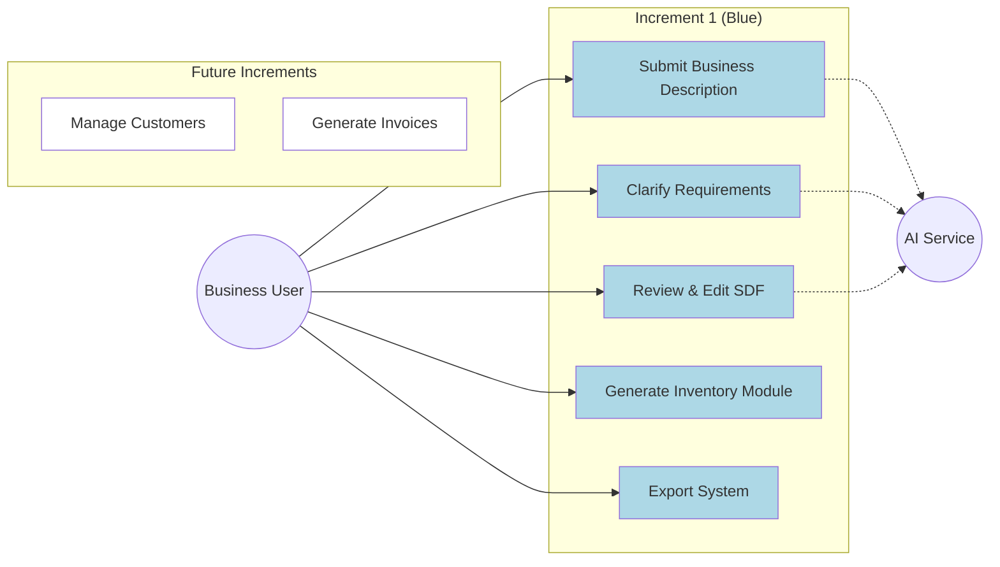
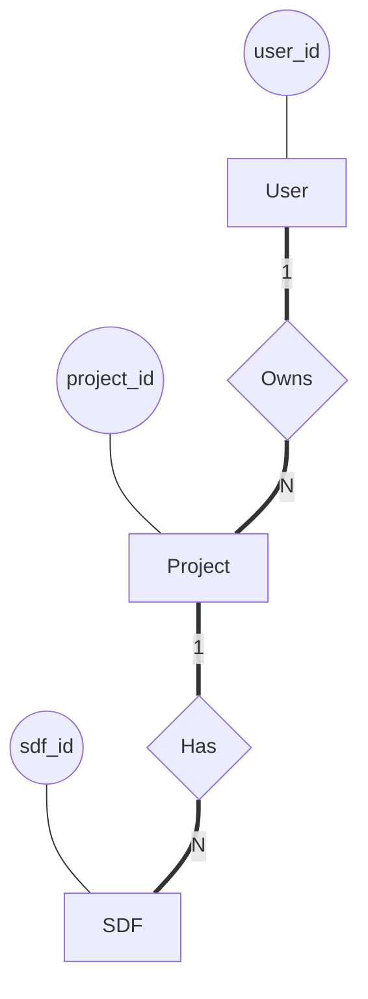
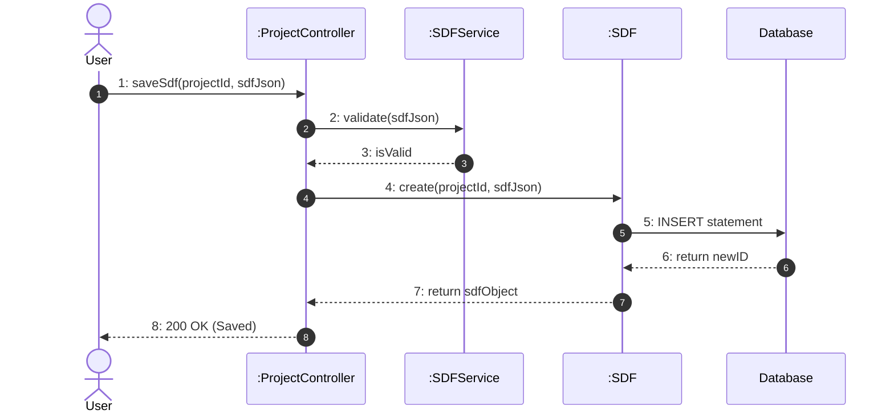

# CTIS 411 – Deliverable 4 (SDD) Answers

## Question 1.1: Use Case Diagram with Increment Coloring
**Reference Context:** Master Reference Section 5 (Increment Scope Definition) & Section 10 (Logical System Flow).
**Implementation Detail:**
- **Frontend:** `platform/frontend/src/pages/` (Dashboard, ProjectWizard)
- **Backend Routes:** `platform/backend/src/routes/projectRoutes.js` (Endpoints: `/analyze`, `/clarify`, `/sdf/save`, `/generate`)
- **Database:** `projects` table (status tracking: 'Draft', 'Analyzing', 'Clarifying', 'Ready')

**Formal Answer:**
The system functionality is encapsulated in the following core Use Cases. For the **1st Increment**, the focus is strictly on the "Inventory" vertical and the generation of the System Definition File (SDF).

**Actors:**
- **Business User:** The primary actor providing natural language requirements.
- **AI Service:** The external agent (Google Gemini) acting as a specialized processor for requirements.

**Use Cases & Increment Status:**

Figure 1 below shows the **System-Level Use Case Diagram**. Use cases highlighted in **Blue** correspond to **Increment 1** and are fully implemented. Uncolored use cases are planned for future increments.



**Figure 1: Use Case Diagram with Increment Coloring.**

1.  **Submit Business Description (Implemented - Increment 1):** The user provides a natural language description of their business processes.
    -   *Implementation:* Mapped to `POST /api/projects/:id/analyze`.
2.  **Clarify Requirements (Implemented - Increment 1):** The system identifies ambiguities and asks the user for clarification.
    -   *Implementation:* Mapped to `POST /api/projects/:id/clarify` and the `questions` table.
3.  **Review & Edit SDF (Implemented - Increment 1):** The user views the generated data model (SDF) and requests AI-driven edits or manual overrides.
    -   *Implementation:* Mapped to `POST /api/projects/:id/sdf/ai-edit` and `POST /api/projects/:id/sdf/save`.
4.  **Generate Inventory Module (Implemented - Increment 1):** The system generates the actual software artifacts (Database Schema, API, UI) for the Inventory module.
    -   *Implementation:* Mapped to `POST /api/projects/:id/generate`.
5.  **Export System (Implemented - Increment 1):** The user downloads the generated source code as a ZIP archive.
    -   *Implementation:* Mapped to the generation controller returning a file stream.

*Note: Use cases related to Customer Management, Invoicing, and Multi-tenant deployment are explicitly deferred to future increments.*

---

## Question 1.2: Selected Architecture
**Reference Context:** Master Reference Section 9 (High-Level Architecture Description).
**Implementation Detail:**
- **Frontend:** React (Vite) Single Page Application (`platform/frontend`).
- **Backend:** Node.js/Express REST API (`platform/backend`).
- **AI Service:** Python/FastAPI Microservice (`platform/ai-gateway`).
- **Database:** PostgreSQL (`docker-compose.yml`).

**Formal Answer:**
**Selected Architecture:** N-Tier Layered Microservices Architecture.

**Justification & NFR Mapping:**
1.  **Maintainability (Separation of Concerns):** The system is divided into distinct layers:
    -   **Presentation Layer (Client):** Handles UI/UX logic (React).
    -   **Application Layer (Server):** Handles business logic, authentication, and project management (Express.js).
    -   **AI Integration Layer (Microservice):** Isolates the volatile AI interaction logic and prompt engineering (Python/FastAPI).
    -   **Data Layer:** Persistent storage (PostgreSQL).
2.  **Portability:** The use of Docker containers for each service (`customwerp-frontend`, `customwerp-backend`, `customwerp-ai-gateway`) ensures the system can be deployed on any environment supporting containerization, satisfying the portability requirement.
3.  **Scalability/Performance:** The AI processing, which is computationally expensive and high-latency, is offloaded to a dedicated `ai-gateway` service. This prevents the main application backend from blocking during SDF generation.

**Advantages:**
-   **Technology Heterogeneity:** Allows using Python for AI tasks (where it excels) and Node.js for I/O-heavy web handling.
-   **Independent Scaling:** The AI Gateway can be scaled independently of the main API.

**Disadvantages:**
-   **Complexity:** Requires orchestration (Docker Compose) and inter-service communication management.
-   **Latency:** Network overhead between Backend and AI Gateway.

---

## Question 1.3: Logical View
**Reference Context:** Master Reference Section 10 (Logical System Flow) & 11 (Data Design Assumptions).
**Implementation Detail:**
- **Database Schema:** `platform/backend/migrations/001_initial_schema.sql`
- **Models:** `Project.js`, `SDF.js`

**Formal Answer:**
**System Function & Interaction:**
The system functions as a pipeline. The **Frontend** captures user input and sends it to the **Backend API**. The Backend creates a `Project` record and forwards the description to the **AI Gateway**. The AI Gateway interacts with the LLM to produce a `System Definition File (SDF)` (JSON format). This SDF is stored in the **Database**. Subsequent user interactions (clarifications, edits) update this SDF. Finally, the **Assembler** (part of the backend) uses the SDF to generate code artifacts.

**EER Diagram (Chen Notation):**

Figure 2 illustrates the **Extended Entity-Relationship (EER) Diagram** using **Chen notation**.
- **Entities:** Represented by rectangles (e.g., User, Project).
- **Relationships:** Represented by diamonds (e.g., Owns, Has).
- **Attributes:** Represented by ovals (e.g., email, version).
- **Cardinalities:** Explicitly defined as 1 (One) or N (Many).
- **Participation:** Participation is **Total** where foreign keys are mandatory (e.g., SDF must belong to a Project) and **Partial** where optional.



**Figure 2: EER Diagram (Chen Notation).**

The database schema implements the following logical entities:

1.  **User:** (Attributes: `user_id`, `email`, `password_hash`, `name`)
    -   *One-to-Many* with **Project** (One User owns Many Projects).
2.  **Project:** (Attributes: `project_id`, `name`, `status`, `description`)
    -   *One-to-Many* with **SDF** (A project has many SDF versions).
    -   *One-to-Many* with **Question** (A project has many clarification questions).
3.  **SDF (System Definition File):** (Attributes: `sdf_id`, `version`, `json_content`)
    -   Contains the generated schema structure (Entities, Attributes, Relations) as a JSON blob, but also relationally mapped for indexing:
    -   *One-to-Many* with **SDF_Entity**.
4.  **SDF_Entity:** (Attributes: `entity_id`, `name`, `slug`)
    -   *One-to-Many* with **SDF_Attribute** (Fields like string, int, date).
    -   *One-to-Many* with **SDF_Relation** (Relationships between entities).
5.  **Module:** (Attributes: `module_id`, `type`, `status`)
    -   Represents the generated output (e.g., Inventory Module).
    -   *One-to-Many* with **Schema_Artifact** (The actual generated files).

**Cardinalities:**
-   User (1) ---- (N) Project
-   Project (1) ---- (N) SDF
-   SDF (1) ---- (N) Entity
-   Entity (1) ---- (N) Attribute

---

## Question 1.4: Physical View
**Reference Context:** Master Reference Section 12 (Deployment and Physical View).
**Implementation Detail:**
- **Configuration:** `docker-compose.yml`
- **Services:** `postgres:16-alpine`, `backend` (Node), `frontend` (Vite/Nginx), `ai-gateway` (Python).

**Formal Answer:**
**UML Deployment Diagram Description:**
The system is deployed as a cluster of Docker containers communicating via a private bridge network (`customwerp-network`).

1.  **Node: Client Workstation**
    -   **Artifact:** Web Browser (Chrome/Firefox)
    -   **Communication:** HTTP/HTTPS to Frontend Container.
2.  **Node: Docker Host (Server)**
    -   **Container: customwerp-frontend**
        -   *Component:* Nginx/Vite Server.
        -   *Port:* 5173 (Mapped to Host).
    -   **Container: customwerp-backend**
        -   *Component:* Node.js Express API.
        -   *Port:* 3000.
        -   *Dependencies:* Depends on Postgres and AI Gateway.
    -   **Container: customwerp-ai-gateway**
        -   *Component:* Python FastAPI Service.
        -   *Port:* 8000.
    -   **Container: customwerp-postgres**
        -   *Component:* PostgreSQL 16 Database.
        -   *Port:* 5432.

**Interaction:**
-   Frontend -> Backend (REST over HTTP).
-   Backend -> AI Gateway (Internal HTTP).
-   Backend -> Postgres (TCP/IP 5432).

---

## Question 2: Design Quality
**Reference Context:** Master Reference Section 8 (Non-Functional Requirements) & Section 13 (Design Quality).
**Implementation Detail:**
- **Usability:** `ProjectWizard` component (Frontend).
- **Security:** `auth.js` middleware, `bcryptjs` (Backend).
- **Maintainability:** `controllers/`, `services/`, `models/` directory structure.

**Formal Answer:**
**Satisfaction of Non-Functional Requirements (NFRs):**

1.  **Usability:**
    -   *Design:* The design uses a "Wizard" pattern to guide non-technical users through the complex process of ERP definition. It hides technical schema details behind natural language interactions.
    -   *Verification:* Verified through Acceptance Testing (User scenarios) where a non-technical user attempts to generate a module without assistance.
2.  **Performance:**
    -   *Design:* Asynchronous processing is used for AI tasks. The `generation_jobs` table tracks long-running processes (Analysis, Generation) so the UI remains responsive (polling/websockets) rather than freezing.
    -   *Verification:* Verified via System Testing by measuring UI response time during a concurrent AI analysis request (Target: UI responds < 200ms, Analysis runs in background).
3.  **Security:**
    -   *Design:* All API endpoints are protected via JWT (JSON Web Tokens). Passwords are hashed using `bcrypt` with salt. Database access is isolated within the Docker network; only the backend can talk to the DB directly (mostly).
    -   *Verification:* Verified via Unit Tests on `authService` and Integration Tests attempting unauthorized access to protected routes.
4.  **Maintainability:**
    -   *Design:* Strict separation of concerns (Layered Architecture). The AI logic is completely decoupled in `ai-gateway`, allowing the AI model to be swapped (e.g., Gemini to GPT-4) without touching the core ERP backend.
    -   *Verification:* Verified by Code Review ensuring no direct DB calls exist in Controllers, and no AI logic exists in the Presentation layer.

---

## 3. Test Case Design

### 3.1 Unit Test Design
**PART A – Test Scope**
Unit tests for the First Increment focus on verifying the correctness of isolated logic within the backend services. The scope includes:
*   Validation logic for the "Business Description" submission (length, content type).
*   Parsing and normalization routines within the `SDFService` that convert raw AI JSON responses into the standardized System Definition File structure.
*   State management logic in the `ProjectService` (transitioning projects from 'Draft' to 'Analyzing' to 'Ready').
*   Authentication logic in the `AuthService` to ensure secure access to project endpoints.
*   Prompt construction functions in the AI Gateway that format user inputs for the LLM.

**PART B – Test Design Approach**
Unit tests are designed using a white-box methodology, inspecting the internal structure of code modules. Mock objects are used to simulate external dependencies, specifically the PostgreSQL database and the Google Gemini AI API. This ensures that tests run quickly and deterministically without network latency. This test level is necessary to catch logic errors, boundary conditions, and data type mismatches early in the development cycle, particularly given the complex data transformations required for the SDF.

**PART C – Test Case Format and Fields**
Unit test cases shall be formatted according to the following standard schema:
*   **Test Case ID:** Unique identifier for the test case (e.g., UT-001).
*   **Related Requirement ID:** Reference to the specific requirement or function being tested.
*   **Test Objective:** A concise statement of what logic is being verified.
*   **Preconditions:** State of the class or function inputs required before execution.
*   **Test Data / Mock Setup:** Specific inputs or mock configurations used.
*   **Test Steps:** Detailed sequence of actions to execute the unit of code.
*   **Expected Result:** The anticipated return value or state change.
*   **Actual Result:** Recorded outcome after execution.
*   **Pass/Fail Status:** Result of the comparison between Expected and Actual results.

### 3.2 Software Integration Test Design
**PART A – Test Scope**
Integration tests for the First Increment verify the successful interaction between the distinct architectural components. The scope includes:
*   The asynchronous workflow where the Node.js Backend submits a task to the Python AI Gateway.
*   The data flow of the `analyze` and `clarify` endpoints, ensuring the AI Gateway correctly receives context and returns a valid SDF.
*   The persistence layer, verifying that generated SDF objects and Project records are correctly stored and retrieved from the PostgreSQL database.
*   The interface between the Backend and the Assembler module responsible for packaging the generated Inventory module into a ZIP file.

**PART B – Test Design Approach**
Integration tests use a gray-box approach, treating individual services as black boxes while validating the data contracts (JSON payloads) passed between them. The approach verifies that the system components function correctly as a group within the Docker container environment. This test type is strictly necessary to detect interface defects, such as serialization errors between Node.js and Python, or connectivity issues with the database, which cannot be identified by unit testing.

**PART C – Test Case Format and Fields**
Integration test cases shall be formatted according to the following standard schema:
*   **Test Case ID:** Unique identifier for the test case (e.g., INT-001).
*   **Interface / API Endpoint ID:** Reference to the specific interface or API endpoint being tested.
*   **Test Objective:** Description of the interaction being verified.
*   **Preconditions:** Required state of the participating services (e.g., AI Gateway is healthy).
*   **Input Payload:** Data sent across the interface.
*   **Test Steps:** Sequence of operations to trigger the interaction.
*   **Expected Response / Side Effects:** Expected status codes, JSON responses, or database updates.
*   **Actual Result:** Observed response or system behavior.
*   **Pass/Fail Status:** Result of the verification.

### 3.3 System Test Design
**PART A – Test Scope**
System tests validate the end-to-end functionality of the First Increment as a complete product. The scope encompasses the full user journey:
*   Submitting a natural language business description via the Frontend Wizard.
*   Receiving and answering clarification questions generated by the system.
*   Reviewing the visual representation of the generated Inventory data model (SDF).
*   Triggering the generation process and successfully downloading the exported source code.
*   Verifying that out-of-scope features (e.g., Invoicing) are not accessible or present.

**PART B – Test Design Approach**
System tests are designed using a black-box methodology, interacting strictly with the Frontend UI (Project Wizard and Dashboard). The approach validates that the system meets the functional requirements defined in the Master Reference. It verifies error handling, loading states during asynchronous AI processing, and the usability of the clarification flow. This level is necessary to ensure the integrated increment delivers a cohesive and stable user experience under production-like conditions.

**PART C – Test Case Format and Fields**
System test cases shall be formatted according to the following standard schema:
*   **Test Case ID:** Unique identifier for the test case (e.g., SYS-001).
*   **Related Use Case (Increment 1):** Reference to the Use Case being exercised.
*   **Test Objective:** The specific functionality or scenario being validated.
*   **Preconditions:** User login state, database population, or configuration.
*   **Test Steps:** Step-by-step user actions on the interface.
*   **Expected Result:** Visible system responses, UI updates, or artifact downloads.
*   **Actual Result:** Observed system behavior.
*   **Pass/Fail Status:** Result of the validation.

### 3.4 Acceptance Test Design
**PART A – Test Scope**
Acceptance tests focus on validating the business value of the First Increment. The scope is limited to the correctness and utility of the generated "Inventory" module. It verifies that:
*   The generated entities (e.g., Product, Stock) match the semantic intent of the user's description.
*   The exported artifacts (Database Schema, API) are syntactically correct and deployable.
*   The system correctly handled specific business constraints (e.g., tracking expiration dates for food items).

**PART B – Test Design Approach**
Acceptance tests use a validation methodology driven by real-world business scenarios. These tests are designed to be performed by the Product Owner or Domain Expert. The approach involves defining high-level business goals (e.g., "Create a generic inventory system for a bookstore") and verifying that the output allows a user to perform those functions. This is the final gate to confirm the increment satisfies the "Inventory module generation" requirement.

**PART C – Test Case Format and Fields**
Acceptance test cases shall be formatted according to the following standard schema:
*   **Test Case ID:** Unique identifier for the test case (e.g., UAT-001).
*   **User Story / Business Goal:** Reference to the specific business need.
*   **Test Objective:** Verification of the semantic correctness of the output.
*   **Preconditions:** Operational environment setup.
*   **Test Steps:** Business-level actions performed by the user.
*   **Acceptance Criteria:** Specific conditions that must be met for approval.
*   **Expected Result:** The business outcome achieved (e.g., "Schema contains 'ISBN' field").
*   **Actual Result:** The actual outcome observed by the user.
*   **Pass/Fail Status:** Decision on whether to accept or reject the feature.

---

## Question 4: Low-Level Design (1st Increment Only)
**Reference Context:** Master Reference Section 15 (Low-Level Design Expectations).
**Implementation Detail:**
- **Pseudocode Source:** `platform/ai-gateway/src/services/sdf_service.py` (`generate_sdf_from_description`).
- **Class Diagram Source:** `platform/backend/src/models/Project.js`, `SDF.js`.

**Formal Answer:**
**4.1 Pseudocode (SDF Generation Logic):**

```python
FUNCTION generate_sdf(user_description):
    VALIDATE user_description is not empty
    
    # Step 1: Prompt Engineering
    prompt = CONSTRUCT_PROMPT("Analyze this business: " + user_description)
    
    # Step 2: AI Interaction
    raw_response = CALL_LLM(prompt, temperature=0.2)
    
    # Step 3: Parse & Heal
    TRY:
        json_data = PARSE_JSON(raw_response)
    CATCH JSONError:
        fix_prompt = "Fix this invalid JSON: " + raw_response
        json_data = CALL_LLM(fix_prompt, temperature=0.0)
    
    # Step 4: Validate Schema
    IF NOT VALIDATE_SCHEMA(json_data, SDF_Schema):
        THROW ValidationError
        
    # Step 5: Normalize
    sdf = NORMALIZE_TYPES(json_data) # Convert 'int' to 'integer', etc.
    
    RETURN sdf
```

**4.2 Use Case Realization (Review & Approve):**

Figure 3 presents the **UML Communication Diagram** for the 'Review & Approve' use case. This diagram highlights the message passing between the Controller, Service, and Data Access Objects.



**Figure 3: UML Communication Diagram (realized as Sequence Flow).**

-   **Controller:** `ProjectController.saveSdf(req, res)`
    1.  Receives `projectId` and `sdfJson`.
    2.  Calls `SDF.create(projectId, sdfJson)`.
-   **Model:** `SDF.create()`
    1.  Queries MAX(version) for project.
    2.  Inserts new row with `version + 1`.
    3.  Returns new `sdf_id`.
-   **Response:** Controller returns 200 OK with new Version ID.

**4.3 Class Design (Key Backend Classes):**

*   **ProjectService** (Singleton)
    *   `createProject(userId, data): Project`
    *   `getProject(id, userId): Project`
*   **AuthService** (Singleton)
    *   `register(user): Token`
    *   `login(credentials): Token`
*   **SDFService** (AI Gateway Class)
    *   `generate_sdf_from_description(str): SystemDefinitionFile`
    *   `clarify_sdf(str, SDF, answers): SystemDefinitionFile`
    *   `edit_sdf(str, SDF, instructions): SystemDefinitionFile`
