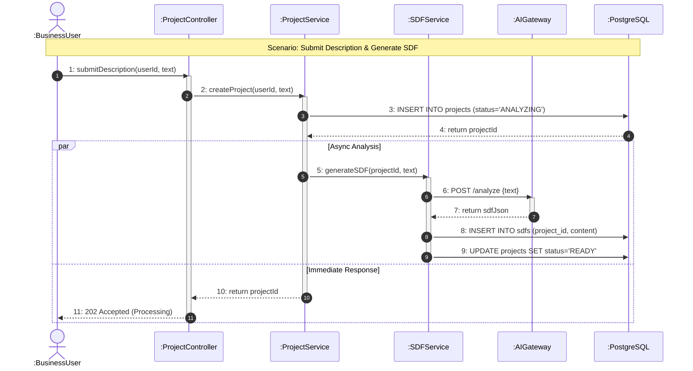
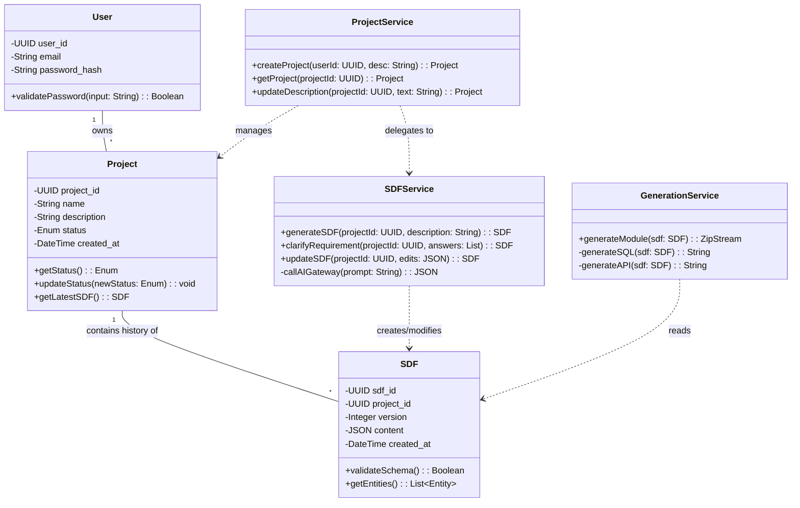

# 3. Low-Level Design

## 3.1 Use Case Realization

The realization of the First Increment Use Cases is achieved through a strict separation of concerns within the N-Tier Layered Architecture. The primary flow of control orchestrates interactions between the **Presentation Layer** (React Frontend), the **Application Layer** (Node.js Backend), the **AI Integration Layer** (Python Microservice), and the **Data Access Layer** (PostgreSQL).

The core realization strategy employs the **Controller-Service-Repository** pattern:

1.  **Controller Layer (`ProjectController`):** Acts as the entry point for HTTP requests. It handles input validation (e.g., ensuring business descriptions are non-empty strings) and delegates business logic to the Service Layer. It is responsible for translating HTTP status codes (200, 400, 500) based on the outcome of service operations.
2.  **Service Layer (`ProjectService`, `SDFService`):** Encapsulates the core business rules.
    *   `ProjectService` manages the lifecycle of a project (Draft -> Analyzing -> Ready).
    *   `SDFService` acts as a proxy to the AI Gateway, managing the asynchronous request/response cycle required to generate the System Definition File (SDF).
3.  **Persistence Layer (`ProjectRepository`, `SDFRepository`):** Abstracs the database interactions. It executes SQL queries to store and retrieve Project metadata and SDF JSON blobs, ensuring data integrity and transactional consistency.

## 3.2 UML Communication Diagram

The following UML Communication Diagram illustrates the realization of the **"Submit Business Description"** and **"Generate SDF"** Use Case. It depicts the message passing sequence required to transform a natural language description into a structured data model.

**Message Flow Description:**
1.  The **User** initiates the process by submitting a description via the `ProjectController`.
2.  The `ProjectController` requests the `ProjectService` to create a new project record.
3.  The `ProjectService` persists the initial state in the `Database`.
4.  The `ProjectService` asynchronously triggers the `SDFService` to begin analysis.
5.  The `SDFService` constructs a prompt and sends a request to the `AIGateway`.
6.  The `AIGateway` processes the request and returns the structured `SDFJson`.
7.  The `SDFService` saves the generated SDF version to the `Database`.
8.  The system notifies the user (via polling response or socket) that the analysis is complete.



## 3.3 Pseudocode

The following pseudocode details the algorithmic logic for the **SDF Generation** process. This logic resides primarily within the AI Gateway and SDF Service. It handles the non-deterministic nature of Large Language Models (LLMs) by implementing parsing validation and retry mechanisms ("Self-Healing").

```text
ALGORITHM GenerateSystemDefinitionFile
INPUT:  user_description (String), project_id (Integer)
OUTPUT: sdf_object (JSON Object)

BEGIN
    // 1. Validation
    IF user_description IS EMPTY OR LENGTH(user_description) < 10 THEN
        THROW ValidationError("Description too short")
    END IF

    // 2. Prompt Construction
    system_prompt = "You are a Software Architect. Output strictly valid JSON."
    user_prompt = "Create an Inventory Module ERD for: " + user_description
    
    // 3. AI Execution with Retry Logic
    attempts = 0
    max_retries = 3
    valid_sdf = NULL

    WHILE attempts < max_retries AND valid_sdf IS NULL DO
        TRY
            raw_response = CallLLM(system_prompt, user_prompt, temperature=0.2)
            parsed_json = ParseJSON(raw_response)
            
            // 4. Schema Validation
            validation_errors = ValidateAgainstSchema(parsed_json, SDF_Schema_Definition)
            
            IF validation_errors IS EMPTY THEN
                valid_sdf = parsed_json
            ELSE
                // Self-Correction Prompt
                user_prompt = "Previous JSON had errors: " + validation_errors + ". Fix it."
                attempts = attempts + 1
            END IF
        CATCH JSONParseError THEN
             user_prompt = "The response was not valid JSON. Return ONLY JSON."
             attempts = attempts + 1
        END TRY
    END WHILE

    IF valid_sdf IS NULL THEN
        THROW GenerationFailedError("AI could not produce valid SDF")
    END IF

    // 5. Post-Processing & Persistence
    normalized_sdf = NormalizeDataTypes(valid_sdf) // e.g., 'int' -> 'INTEGER'
    SaveToDatabase(project_id, normalized_sdf)
    
    RETURN normalized_sdf
END
```

## 3.4 UML Class-Level Design

The Class Diagram defines the static structure of the backend system for the First Increment. It focuses on the entities responsible for Project management and SDF manipulation.

**Key Design Decisions:**
*   **Encapsulation:** All attributes are private (`-`) and accessed via public methods (`+`), adhering to object-oriented principles.
*   **Service Facades:** The `ProjectService` acts as a facade, coordinating the `SDFService` and repositories.
*   **Separation of Data and Logic:** Data models (`Project`, `SDF`) are distinct from the services (`ProjectService`) that operate on them.


