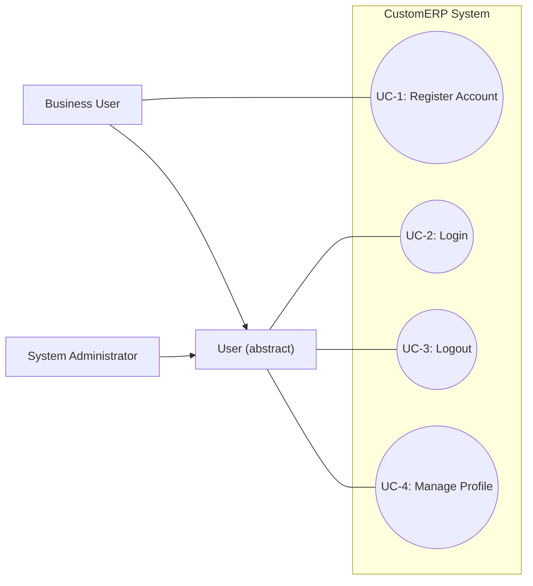
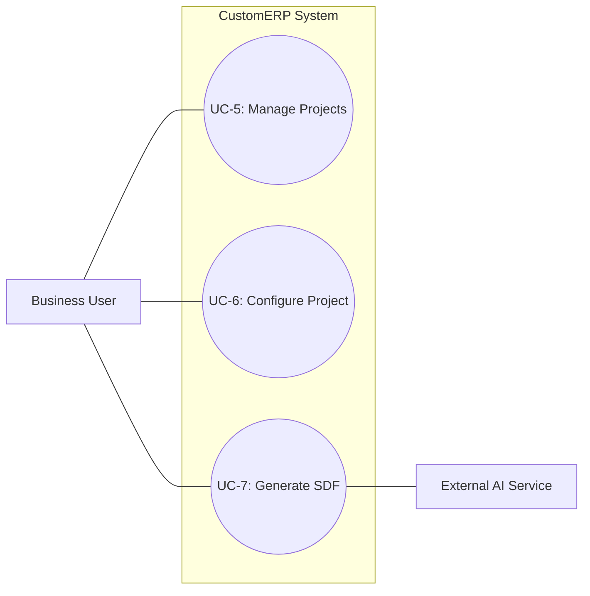
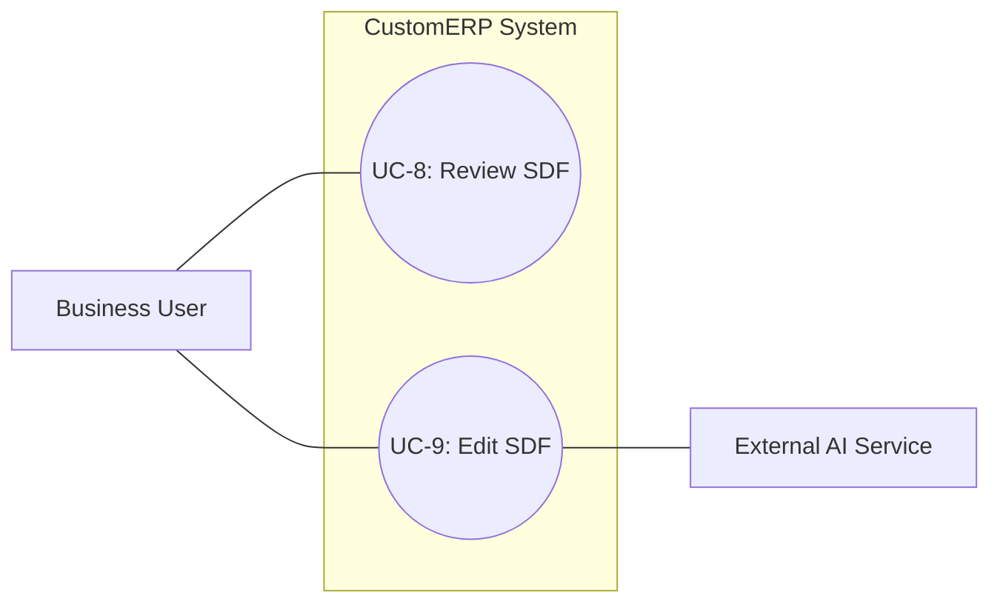
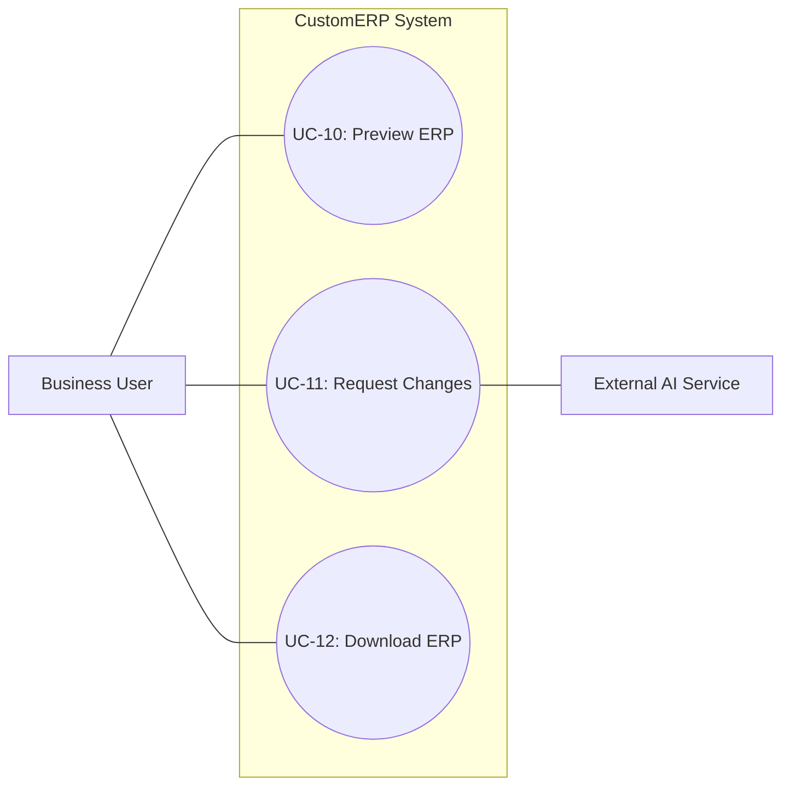
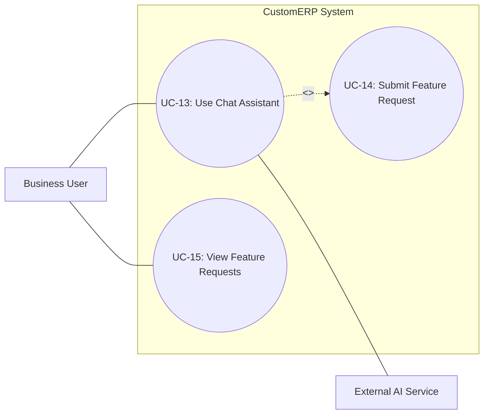
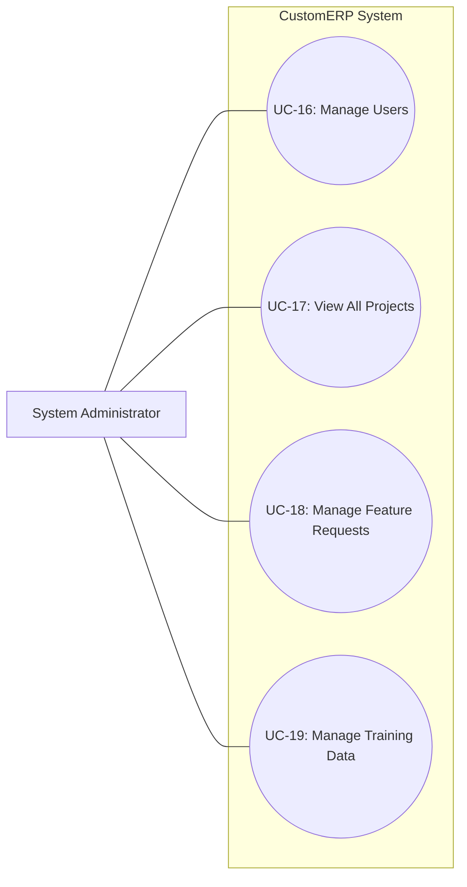
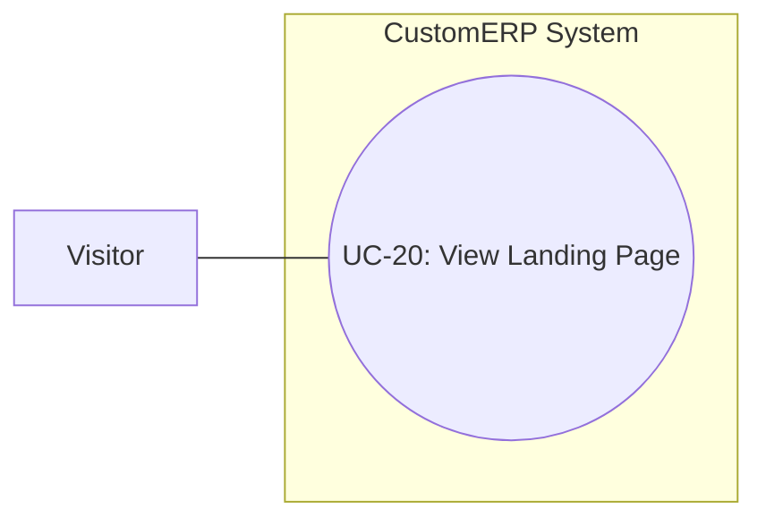
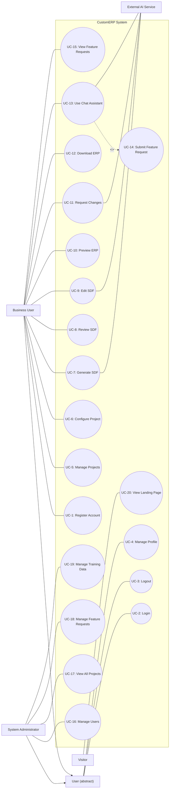

# CustomERP — Use Case Specification (UML-Compliant)

> **Scope Note:** These use cases are for the CustomERP platform itself, not for the ERP systems it generates. Features visible inside the generated ERP preview (e.g., Import CSV, managing ERP users/roles, inventory operations) belong to the output product's own use case specification.

## System
**CustomERP System**

## Actors

| Actor | Type | Position | Description |
|-------|------|----------|-------------|
| Visitor | Primary | Left | Unauthenticated person viewing the public landing page |
| User *(abstract)* | Primary | Left | Any authenticated user (parent of Business User and System Administrator) |
| Business User | Primary | Left | Authenticated user who creates and configures ERP projects |
| System Administrator | Primary | Left | Authenticated user with elevated privileges for platform management |
| External AI Service | Secondary | Right | Third-party LLM API (Google Gemini / Azure OpenAI) used for SDF generation, editing, and chat |

### Generalization
- Business User → User
- System Administrator → User

---

## Use Case List

| ID | Use Case | Primary Actor | Secondary Actor |
|----|----------|---------------|-----------------|
| UC-1 | Register Account | Business User | — |
| UC-2 | Login | User | — |
| UC-3 | Logout | User | — |
| UC-4 | Manage Profile | User | — |
| UC-5 | Manage Projects | Business User | — |
| UC-6 | Configure Project | Business User | — |
| UC-7 | Generate SDF | Business User | External AI Service |
| UC-8 | Review SDF | Business User | — |
| UC-9 | Edit SDF | Business User | External AI Service |
| UC-10 | Preview ERP | Business User | — |
| UC-11 | Request Changes | Business User | External AI Service |
| UC-12 | Download ERP | Business User | — |
| UC-13 | Use Chat Assistant | Business User | External AI Service |
| UC-14 | Submit Feature Request | — (included from UC-13) | — |
| UC-15 | View Feature Requests | Business User | — |
| UC-16 | Manage Users | System Administrator | — |
| UC-17 | View All Projects | System Administrator | — |
| UC-18 | Manage Feature Requests | System Administrator | — |
| UC-19 | Manage Training Data | System Administrator | — |
| UC-20 | View Landing Page | Visitor | — |

---

## UCD-1: Authentication & Account Management

**Actors:** User (abstract), Business User, System Administrator

| Use Case | Description |
|----------|-------------|
| UC-1: Register Account | A new user creates an account with name, email, and password |
| UC-2: Login | An authenticated user signs into the system with credentials |
| UC-3: Logout | An authenticated user ends their session |
| UC-4: Manage Profile | An authenticated user updates their name/email, changes their password, or deletes their account |



---

## UCD-2: Project Management & Configuration

**Actors:** Business User, External AI Service

| Use Case | Description |
|----------|-------------|
| UC-5: Manage Projects | User views the project list, creates a new project, deletes an existing project, or opens a project |
| UC-6: Configure Project | User selects ERP modules (inventory, invoice, HR), answers business questions, and answers module-specific default questions |
| UC-7: Generate SDF | System sends configuration to the External AI Service which generates a System Definition File through a multi-agent pipeline |



---

## UCD-3: SDF Review & Editing

**Actors:** Business User, External AI Service

| Use Case | Description |
|----------|-------------|
| UC-8: Review SDF | User views the generated SDF summary (entities, fields, modules) and approves or rejects it |
| UC-9: Edit SDF | User modifies the SDF either by providing natural-language instructions to the AI or by editing the JSON directly |



---

## UCD-4: ERP Preview & Export

**Actors:** Business User, External AI Service

| Use Case | Description |
|----------|-------------|
| UC-10: Preview ERP | User launches a live preview of the generated ERP in an embedded iframe to test the result |
| UC-11: Request Changes | From the preview page, user describes desired changes in a text field; the system sends these to the AI for regeneration |
| UC-12: Download ERP | User downloads the generated ERP as a standalone bundle for a selected platform (Windows/macOS/Linux) or as a Docker ZIP |



---

## UCD-5: Communication & Feature Requests

**Actors:** Business User, External AI Service

| Use Case | Description |
|----------|-------------|
| UC-13: Use Chat Assistant | User converses with the AI assistant to discuss ERP features, get module recommendations, and ask questions. When unsupported features are detected, the system automatically creates a feature request (UC-14). |
| UC-14: Submit Feature Request | The system automatically creates a feature request when the chatbot detects an unsupported feature during a chat session. This is not user-initiated — it is `<<include>>`d from UC-13. |
| UC-15: View Feature Requests | User views the status and message history of their own previously submitted feature requests |



---

## UCD-6: Administration

**Actors:** System Administrator

| Use Case | Description |
|----------|-------------|
| UC-16: Manage Users | Admin views all users, edits user details, toggles admin status, or soft-deletes users |
| UC-17: View All Projects | Admin views all projects across all users with status information |
| UC-18: Manage Feature Requests | Admin views all feature requests, updates their status, and responds to users |
| UC-19: Manage Training Data | Admin reviews AI generation sessions, rates agent output quality, and exports data for model fine-tuning |



---

## UCD-7: Public Access

**Actors:** Visitor

| Use Case | Description |
|----------|-------------|
| UC-20: View Landing Page | An unauthenticated visitor views the public marketing page with product information and links to register or login |



---

## Overall Use Case Diagram



---

## What Was Included vs. Excluded

The UML standard says a use case must represent a **complete user goal** — something one person does, at one time, that delivers measurable value and leaves data in a consistent state (the "Elementary Business Process" test). Anything that is a *step within* a larger goal, a *UI detail*, *system-internal behavior*, or a *feature of the generated output* does **not** belong in the diagram.

### Included (mapped to use cases)

| Feature | Mapped To | Reason |
|---------|-----------|--------|
| Creating an account | UC-1: Register Account | Distinct user goal |
| Logging in | UC-2: Login | Distinct user goal |
| Logging out | UC-3: Logout | Distinct user goal |
| Deleting account | UC-4: Manage Profile | Part of managing one's own account settings |
| Changing name, email | UC-4: Manage Profile | Same goal — user manages their profile information |
| Changing password | UC-4: Manage Profile | Same goal — user manages their account security |
| Create project | UC-5: Manage Projects | CRUD on the same entity is grouped into one use case |
| Delete project | UC-5: Manage Projects | CRUD on the same entity is grouped into one use case |
| Open project | UC-5: Manage Projects | Viewing/opening is part of project management |
| Choosing modules | UC-6: Configure Project | Part of the project configuration goal |
| Answering questions | UC-6: Configure Project | Part of the project configuration goal |
| Saving the answers | UC-6: Configure Project | Saving is the natural completion of configuration, not a separate goal |
| Saving configuration | UC-6: Configure Project | Same — saving is a step, not a standalone goal |
| Show developer details | UC-8: Review SDF | Viewing technical details is part of reviewing the SDF |
| Editing JSON directly | UC-9: Edit SDF | One method of editing the SDF |
| Asking AI assistant to make changes | UC-9: Edit SDF | AI edit is another method of editing the SDF |
| Previewing the ERP | UC-10: Preview ERP | Distinct user goal |
| Requesting change from the textfield | UC-11: Request Changes | Distinct goal — triggers a full AI regeneration cycle |
| Applying changes and downloading | UC-11 + UC-12 | "Applying" is part of Request Changes; "downloading" is Download ERP |
| Downloading | UC-12: Download ERP | Distinct user goal |
| Being able to choose which OS | UC-12: Download ERP | Platform selection is a detail within the download goal |
| Downloading Docker ZIP | UC-12: Download ERP | Another download format within the same goal |
| Asking questions (AI assistant) | UC-13: Use Chat Assistant | Distinct user goal |
| Seeing previous requests | UC-15: View Feature Requests | Viewing request history is a distinct goal |
| Feature request auto-creation | UC-14: Submit Feature Request | Not user-initiated — `<<include>>`d from UC-13 when the chatbot detects unsupported features |

### Excluded (not use cases)

| Feature | Reason for Exclusion |
|---------|---------------------|
| Saving changes (general) | **Step, not a goal.** Saving is the natural end-step of any editing use case. It does not stand alone as a user goal. |
| Recommending which OS to download | **System behavior.** The system auto-detects the OS — this is internal logic, not a user-initiated action. |
| Checking health | **System behavior.** Health monitoring is an automated background check, not a user goal. |
| Checking every checkbox / auto-check every 7 seconds | **UI mechanism / system polling.** This is an implementation detail of how the UI refreshes status, not something the user consciously does as a goal. |
| Applying changes | **Step within a use case.** "Applying" is the execution step of UC-9 (Edit SDF) or UC-11 (Request Changes), not a standalone goal. |
| Import CSV | **Generated ERP feature.** This is a feature of the *output* ERP that appears in the preview, not a feature of the CustomERP platform itself. |
| Export CSV | **Generated ERP feature.** Same — belongs to the generated ERP, not the platform. |
| Print / PDF | **Generated ERP feature.** Same reasoning. |
| Receive, Adjust, Sell, Transfer, Labels | **Generated ERP inventory module features.** These are domain-specific actions within the generated inventory module. They are features of the product the platform *creates*, not of the platform itself. |
| Adding a new entity (+ Add New) | **Generated ERP CRUD operation.** This is a standard CRUD action inside the generated ERP preview. |

### Key Rule

> **The CustomERP platform *generates* ERPs. Features visible inside the generated ERP preview (Import CSV, Export CSV, Print/PDF, inventory operations, CRUD forms) are features of the *output product*, not use cases of the platform.** The platform's use case is "Preview ERP" (UC-10) — what happens *inside* that preview belongs to a separate system (the generated ERP).

---

## YAML Summary

```yaml
system: CustomERP System

actors:
  primary:
    - Visitor
    - "User (abstract)"
    - Business User
    - System Administrator
  secondary:
    - External AI Service (Google Gemini / Azure OpenAI)

generalizations:
  - Business User → User
  - System Administrator → User

use_cases:
  authentication_and_account:
    - UC-1: Register Account
    - UC-2: Login
    - UC-3: Logout
    - UC-4: Manage Profile

  project_management:
    - UC-5: Manage Projects
    - UC-6: Configure Project
    - UC-7: Generate SDF

  sdf_review_and_editing:
    - UC-8: Review SDF
    - UC-9: Edit SDF

  erp_preview_and_export:
    - UC-10: Preview ERP
    - UC-11: Request Changes
    - UC-12: Download ERP

  communication:
    - UC-13: Use Chat Assistant
    - UC-14: Submit Feature Request  # <<include>> from UC-13, not user-initiated
    - UC-15: View Feature Requests

  administration:
    - UC-16: Manage Users
    - UC-17: View All Projects
    - UC-18: Manage Feature Requests
    - UC-19: Manage Training Data

  public:
    - UC-20: View Landing Page

actor_associations:
  External AI Service:
    - UC-7: Generate SDF
    - UC-9: Edit SDF
    - UC-11: Request Changes
    - UC-13: Use Chat Assistant
```
