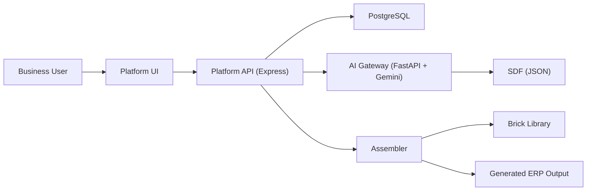

# CustomERP Overview

This document explains how CustomERP works end-to-end: what the system does, how data flows, and how the generator assembles an ERP from a business description.

---

## 1) What CustomERP Is
CustomERP is an **AI‑assisted ERP assembly platform**. It does not ask the AI to write code. Instead:

1. The AI turns a business description into a **System Definition File (SDF)**.
2. The **Assembler** reads the SDF.
3. The Assembler selects and combines **pre‑built bricks** (backend, frontend, templates).
4. The system produces a runnable **Generated ERP** (backend + frontend + data layer).

Key idea: **AI is the Architect, Platform is the Builder.**

---

## 2) System Boundary (Platform vs Generated ERP)

**Platform (what you run to create ERPs):**
- React dashboard (project list, description input, generation controls)
- Express API (project lifecycle + AI orchestration)
- PostgreSQL (stores users, projects, SDFs, logs)
- AI Gateway (FastAPI + Gemini)
- Assembler engine (Node.js)

**Generated ERP (what the platform produces):**
- Backend API (Node.js/Express)
- Frontend UI (React/Tailwind)
- Data storage (JSON flat‑files for Increment 1)

---

## 3) End‑to‑End Flow (UC‑1 → UC‑7)

1. **UC‑1/UC‑2:** User creates a project in the dashboard.
2. **UC‑3:** User writes a business description.
3. **AI Gateway** returns:
   - a partial SDF
   - clarification questions (if needed)
4. **Clarification loop** collects answers and finalizes the SDF.
5. **UC‑4:** Assembler generates the ERP using bricks and templates.
6. **UC‑7:** Generated ERP is packaged and downloaded as a runnable bundle.

Out of scope for now: UC‑5/UC‑6 review and approval UI.

---

## 4) High‑Level Architecture



---

## 5) Core Concepts

**SDF (System Definition File)**  
The SDF is a structured JSON blueprint. It describes:
- entities, fields, relations
- UI behavior (search, CSV, printing)
- inventory operations (receive, issue, adjust, transfer)
- global modules (reports, activity log, dashboards)

See `SDF_REFERENCE.md` for the exact schema.

**Bricks**  
Reusable code fragments that implement features. Examples:
- Backend mixins: audit logging, serial tracking, batch tracking
- Frontend components: dynamic forms, CSV import tools
- Templates: Dockerfile, package.json, README

**Assembler**  
The assembler reads the SDF, picks the bricks, injects them into templates, and writes a runnable ERP to `generated/`.

---

## 6) Platform Components (What They Do)

### 6.1 React Dashboard (Platform Frontend)
- Project list + create project
- Business description input
- Clarification Q/A UI
- Trigger generation

### 6.2 Express API (Platform Backend)
- Auth + project CRUD
- Stores SDF + clarifications
- Orchestrates AI calls
- Invokes assembler

### 6.3 AI Gateway (FastAPI)
- `/ai/analyze` → partial SDF + questions
- `/ai/clarify` → refined SDF
- `/ai/finalize` → final SDF
- Validates output against schema

### 6.4 Platform Database (PostgreSQL)
Stores:
- users, roles, projects
- SDFs and related entities/relations
- clarification questions/answers
- generation jobs + artifact metadata
- log entries

---

## 7) Assembler Engine (How Generation Works)

Key files (see `platform/assembler/`):
- **ProjectAssembler**: main orchestration
- **BackendGenerator**: generates backend API + services
- **FrontendGenerator**: generates UI + routes
- **CodeWeaver**: injects code into templates at hook markers

Flow:
1. Read SDF and resolve modules/features.
2. Generate backend (services, routes, data layer).
3. Generate frontend (pages, wizards, dashboards).
4. Package into a runnable output.

---

## 8) Brick Library

**Backend bricks** (`brick-library/backend-bricks/`)
- Core templates: `BaseService`, `BaseController`
- Mixins: `Audit`, `Inventory`, `Batch`, `Serial`, `Location`
- Data layer: `FlatFileProvider`

**Frontend bricks** (`brick-library/frontend-bricks/`)
- Dynamic form renderer
- CSV import tools
- Shared UI components and layouts

**Templates** (`brick-library/templates/`)
- Dockerfile, docker-compose, package.json
- README template for generated ERP

---

## 9) SDF Summary (What Must Be Present)

Top‑level:
- `project_name`
- `modules`
- `entities[]`

Entity fields:
- `slug`, `display_name`, `fields[]`
- `features` (audit, batch, serial, multi‑location)
- `inventory_ops` for wizards

Relations:
- `reference` fields in entities
- optional `children` for embedded line items

Global modules:
- activity log
- scheduled reports
- inventory dashboard

For full details, see `SDF_REFERENCE.md`.

---

## 10) Generated ERP Output (What Gets Built)

Typical output structure:
```
generated/
└── <project-name>/
    ├── docker-compose.yml
    ├── Dockerfile
    ├── README.md
    ├── package.json
    ├── src/
    │   ├── index.js
    │   ├── routes/
    │   ├── services/
    │   └── repository/
    ├── frontend/
    │   └── src/
    └── data/
```

Data storage is flat JSON files in Increment 1.

---

## 11) Development & Running

**Docker (recommended):**
- `.\scripts\dev.ps1 start` (Windows)
- `./scripts/dev.sh start` (macOS/Linux)

**Without Docker:**
- `platform/backend` (Node + Express)
- `platform/frontend` (React)
- `platform/ai-gateway` (FastAPI)

See `README.md` for full commands and environment variables.

---

## 12) Collaboration Rules (Current Sprint)

**Ownership (default):**
- BTB: `platform/ai-gateway/**`, `SDF_REFERENCE.md`, AI prompts/schemas
- ODD: `platform/backend/**`, `brick-library/backend-bricks/**`
- EA: `platform/frontend/**`, `brick-library/frontend-bricks/**`
- ASA: `platform/assembler/**`, generation wiring/orchestration
- TE: tests + docs only (`docs/**`, `test/**`, `platform/**/tests/**`)

**Do not touch unless approved by ASA:**
- `.env`, `.env.example`, production compose files, migrations
- Other owners’ folders listed above

**Git workflow (default):**
1. `git checkout main`
2. `git pull`
3. `git checkout -b sprint1/<initials>/<task>`
4. Work only in your owned paths
5. `git add -A`
6. `git commit -m "<short message>"`
7. `git push -u origin HEAD`
8. Open PR → ASA reviews → merge

**Branching policy (Sprint 1):**
- One branch per task; do not reuse across phases.
- No shared phase branches; each person works in their own branch.
- ASA may create a short‑lived integration branch for combined testing.

**Docs merge policy (Sprint 1):**
- TE is the doc integrator (ASA oversight).
- Only TE (or ASA) edits `docs/overview.md` and `docs/prompt_expectations.md`.
- Others add notes in `docs/overview_updates/`.
- `docs/after_prompt_care/` uses timestamp filenames (see `docs/after_prompt_care/README.md`).

For phase‑by‑phase rules, see `docs/sprint1.md`.

---

## 13) Current Scope vs Next

**Current focus:**
- Inventory module generator (Increment 1)
- SDF generation and assembler pipeline

**Next focus:**
- Invoice module
- HR module
- Multi‑module generation in one build

**Out of scope for now:**
- UC‑5/UC‑6 review/approval UI

---

## 14) Known Gaps (Summary)

See `UNFINISHED_TASKS.md` for the full list. Key themes:
- SDF finalize + guardrails
- Flexible mixin system
- Generation tracking and logs
- Testing and documentation coverage

---

## 15) Key Documents

- `README.md` — dev setup and commands
- `Blueprint.md` — architecture and design
- `SDF_REFERENCE.md` — authoritative SDF schema
- `FUNCTIONAL_SCOPE.md` — feature scope
- `docs/coding_guidelines.md` — repo-wide coding rules
- `UNFINISHED_TASKS.md` — current backlog
- `NEXT_SPRINT_TASKS.md` — upcoming sprint plan
