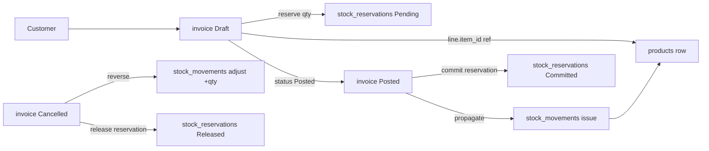
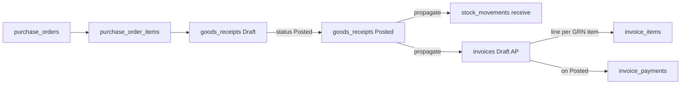
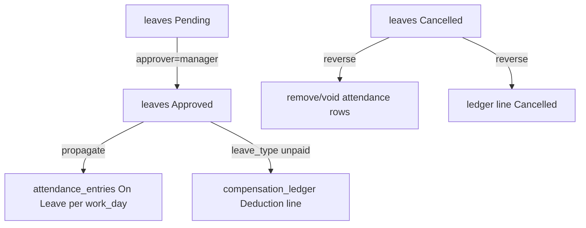
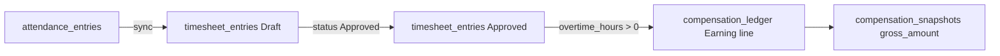
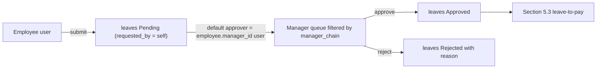
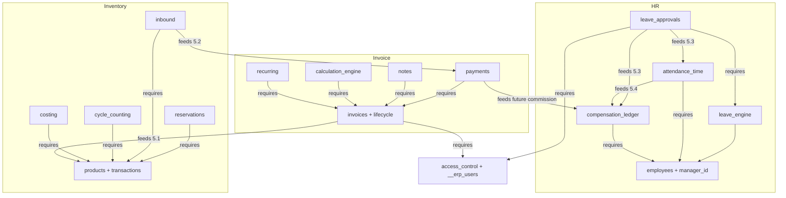

# Module Coherence Design

## Purpose

Today, every capability in the generated ERP is a self-contained bag of entities and config. The wizard turns toggles on (HR Q1–Q7, Inventory Q1–Q11, Invoice Q1–Q8); each toggle creates its own tables, status enums, and mixin wiring; and that is where the integration ends. There is no shared actor model, no cross-pack invariants, and no declared way for one capability to consume or affect another. The result is the symptoms the team has been hitting:

- A `leaves.approver_id` is a free-text string, not a real user.
- An approved leave does not block a shift assignment on the same day.
- An `Unpaid` leave produces no payroll deduction.
- An invoice line for a stocked SKU does not move stock.
- A posted GRN does not draft an AP invoice.
- "Who did this" fields scattered across modules are all strings, not references.

This document is a **design-only** spec for the cross-feature coherence layer that fixes those symptoms while preserving full customizability. It does not change any code. It defines the model that downstream implementation plans (SDF schema extension, wizard dependency wiring, cross-pack mixin layer, localization sweep) will consume.

The audience is the team reviewing whether this is the right shape before we touch:

- [SDF_REFERENCE.md](SDF_REFERENCE.md)
- [platform/backend/src/services/prefilledSdfService.js](platform/backend/src/services/prefilledSdfService.js)
- [platform/assembler/](platform/assembler/) (assembler, generators, systemAndRuntime)
- [brick-library/backend-bricks/mixins/](brick-library/backend-bricks/mixins/)
- [platform/ai-gateway/src/prompts/](platform/ai-gateway/src/prompts/)

---

## Glossary

- **Capability** — One entry in a module wizard (e.g., `hr_enable_leave_engine`, `inv_enable_inbound`, `invoice_enable_payments`). When toggled on, it injects entities, fields, and module config into the SDF.
- **Pack** — The bundle of entities + config + mixin wiring that a capability emits (e.g., the "leave_engine pack" creates `leaves`, `leave_balances`, wires `HRLeaveBalanceMixin`).
- **Actor** — Any user-driven action (request, approve, post, cancel). Today these are recorded as free-text fields like `approver_id`, `posted_by`, `cancelled_by`. In the new model they become references to `__erp_users`.
- **Coherence layer** — The rules, references, derived fields, and propagation paths that link one pack to another. This is what the document defines.
- **Coherence primitive** — One of the five building blocks the layer is made of: reference contract, status propagation, derived field, invariant, permission scope. Every cross-pack rule is one of these five.
- **Owns / Consumes / Produces / Requires** — The four "roles" each capability declares. `Owns` is what it creates. `Requires` is what it cannot run without. `Consumes` is references it pulls from other packs. `Produces` is rows or state changes it emits into other packs.

---

## 1. Principles

Five non-negotiables. Every later section in this document, and every implementation plan that branches off it, must hold to these.

### 1.1 Customizability is preserved

The coherence layer never blocks renaming. Every entity slug, field name, and label remains user-renamable. Cross-pack rules read slugs from module config (the pattern already used in [SDF_REFERENCE.md](SDF_REFERENCE.md), e.g. `modules.hr.leave_engine.leave_entity`, `modules.invoice.payments.payment_entity`). A user who renames `products` to `tires` and `leaves` to `time_off` keeps every rule working because the rule layer never hard-codes a slug.

Every cross-pack link is itself a config toggle (`modules.hr.leave_payroll_link.enabled`, `modules.invoice.stock_link.enabled`, etc.). Off means today's behavior is preserved exactly. The default is "on" for the relationships an SMB owner naturally expects, and "off" for the heavier ones (e.g. invoice stock link off by default if the user has not enabled inventory transactions).

### 1.2 A capability is never standalone

When a capability is toggled on, the SDF must declare four things on it: `owns`, `requires`, `consumes`, `produces`. The wizard, the prefilled SDF builder, and the AI prompts all read those declarations. A capability whose `requires` are not met is auto-completed (its dependencies turn on) or refused (with an explanation to the user) — never silently shipped half-wired.

### 1.3 Actors are users, not strings

Anything that records "who did X" resolves to a `__erp_users` row. There are no `string` actor fields in the new model. `approver_id`, `posted_by`, `cancelled_by`, `created_by`, `requested_by`, `received_by` are all `reference -> __erp_users`. Where today's mixin uses a string config field (e.g. `HRLeaveApprovalMixin.approver_field` → `approver_id`), the field type changes to `reference` and the mixin resolves the actor's `__erp_users` row.

This is what allows approval queues to be filtered by manager chain, RBAC to gate every action, and audit trails to mean something.

### 1.4 Status changes propagate via declared rules, never duplicated state

When today's `leaves.status` becomes `Approved`, the `attendance_entries` for the covered work days do not change. There is no propagation path. We do not solve this by adding a second `is_on_leave` flag to attendance — that creates two sources of truth. We solve it by declaring a propagation rule on the `leave_engine ↔ attendance_time` link: on `leaves.status = Approved`, the attendance pack creates one `attendance_entries` row per covered work day with `status = On Leave`, and on `Cancelled` it removes them. The rule is named, the rule is testable, the rule is config-toggled.

### 1.5 Customer-facing copy is localized through keys, not raw English

Every label, error message, empty-state message, button caption, and wizard question is a localization key with a default English string and a Turkish counterpart, resolved through the existing `i18n/labels` machinery in [platform/assembler/i18n/](platform/assembler/i18n/) and the project-language directives in [platform/ai-gateway/src/prompts/language_directive_en.txt](platform/ai-gateway/src/prompts/language_directive_en.txt). The AI prompt MUST in [hr_generator_prompt.txt](platform/ai-gateway/src/prompts/hr_generator_prompt.txt#L138-L139) for filling `label` becomes an SDF-level enforcement check, not a hope.

---

## 2. Coherence primitives (the rule layer)

Every cross-pack rule in this document is one of exactly five primitives. This is the entire vocabulary; if a rule cannot be expressed as one of these five, the model is wrong and we extend the vocabulary explicitly rather than papering over it in a mixin.

### 2.1 Reference contract

When two packs are both enabled, a string field on one becomes a real `reference` field to the other.

```
when (leave_approvals.enabled AND access_control.enabled):
  leaves.approver_id : string  ->  reference -> __erp_users
```

```
when (leave_engine.enabled AND access_control.enabled):
  leaves.requested_by : string  ->  reference -> __erp_users  (added if missing)
```

The contract is declared on the *consuming* pack so the SDF auto-upgrades the field type when the *required* pack appears. If the required pack is off, the field stays a string (today's behavior, no breakage).

This is how every actor field migrates. It is also how every "soft" foreign key becomes a real one — e.g. `compensation_ledger.source_leave_id` is added when both `compensation_ledger` and `leave_engine` are on.

### 2.2 Status propagation

A capability's status transition fires a named rule that another capability subscribes to. The rule is one row in a `relations` table on the SDF (or a sibling block, exact shape is an implementation choice for the SDF schema plan). Each rule names:

- the source entity and trigger transition (`leaves: Pending -> Approved`),
- the target effect (`create one attendance_entries per covered work_day with status=On Leave`),
- the reverse effect for the opposite transition (`Approved -> Cancelled`: remove those rows or mark them `Voided`).

Today's mixins already do bits of this internally (`HRLeaveApprovalMixin.consume_on_approval` consumes balance on approval, in-process, no propagation surface). The new model surfaces the rule so:

- The wizard can show "leave approval will auto-mark attendance" to the user.
- The AI prompts can know which rules apply when generating an SDF.
- The mixin layer becomes a generic "propagation runner" instead of one-off cross-talk inside each mixin.

### 2.3 Derived (computed) field

A field whose value is always computed from other rows. Marked `computed: true` in the SDF, read-only in API and UI. Never written by users, never written by AI prompts.

Examples that exist today but are stored as user-input fields:

- `products.available_quantity = on_hand - reserved_quantity - committed_quantity` — already partially marked computed in [prefilledSdfService.js](platform/backend/src/services/prefilledSdfService.js) but not enforced everywhere; this is exactly the bug called out in [FOLLOWUP_PLANS.md §2.1](FOLLOWUP_PLANS.md).
- `leaves.leave_days = working_days(start_date, end_date, modules.hr.work_days, holidays)` — currently an integer field a user can type into.
- `invoices.outstanding_balance = grand_total - paid_total` — should never be hand-entered.
- `compensation_snapshots.net_amount = gross_amount - deduction_amount` — same.
- `purchase_order_items.received_quantity = sum(goods_receipt_items.received_quantity)` — currently stored independently and risks drift.

Computed fields are how we make the cross-pack effect of one capability visible without duplicating state.

### 2.4 Invariant

A validation rule that fires whenever a capability is on, expressed as a small DSL the assembler/mixin layer enforces. Invariants are how we get rid of "you can do X if no rule stops you" surprises.

Concrete invariants the model carries:

- `leaves.end_date >= leaves.start_date` (already enforced in [HRLeaveMixin.js](brick-library/backend-bricks/mixins/HRLeaveMixin.js#L13-L15); listed for completeness).
- No `leaves` for the same `employee_id` overlapping another `leaves` row in `Approved` or `Pending` status (missing today).
- `leaves.start_date` must be on or after `employees.hire_date` (missing).
- An employee with `status = Terminated` cannot have new `leaves`, `attendance_entries`, `shift_assignments`, or `compensation_ledger` rows (missing).
- `goods_receipt_items.received_quantity <= purchase_order_items.ordered_quantity - already_received` (partially handled inside the inbound mixin, not declarative).
- `invoice_payments.amount <= invoices.outstanding_balance` (partially handled inside payment mixin, not declarative).
- `shift_assignments.work_date` cannot fall on a date covered by an `Approved` leave for the same employee (missing).
- `attendance_entries.work_date` must be in `modules.hr.work_days` unless explicitly overtime (missing).

Each invariant names: source pack, target field/condition, error key (localized), and severity (block vs warn).

### 2.5 Permission scope

Every actor-driven endpoint requires a permission and a scope. Scopes are a small enum:

- `self` — only own rows (e.g. employee can list own leaves)
- `department` — rows for any employee in `users.scope_department_id`
- `manager_chain` — rows for any employee whose `manager_id` chain includes the actor's `users.employee_id`
- `module` — all rows in this module (HR admin, inventory admin)
- `all` — global (super admin)

Permissions are declared on the capability. When the access control system entities are present (already created by [systemAndRuntime.js](platform/assembler/assembler/systemAndRuntime.js#L73-L189)), the assembler turns capability permission declarations into rows in `__erp_permissions`, and seeds default groups (`SuperAdmin`, `HRAdmin`, `InventoryAdmin`, `InvoiceAdmin`, plus per-module worker groups like `HRWorker`, `InventoryWorker`) with sensible scope/permission presets. The user can add/remove/edit groups freely afterwards — defaults are seeded once.

This is what makes "an employee submits a leave, only their direct manager sees it in the queue" work without a thousand custom controllers.

---

## 3. Users and employees: first-class link

The system already creates `__erp_users` (and `__erp_groups`, `__erp_permissions`, `__erp_user_groups`, `__erp_group_permissions`) as system entities when access control is enabled — see [platform/assembler/assembler/systemAndRuntime.js](platform/assembler/assembler/systemAndRuntime.js#L73-L189). What is missing is the link to `employees` and the use of those users as the canonical actor across the rest of the SDF.

### 3.1 Required when any actor-driven pack is on

Whenever any of these are enabled, `access_control` is auto-enabled and `__erp_users` is required:

- HR: `leave_engine`, `leave_approvals`, `attendance_time`, `compensation_ledger`
- Inventory: `transactions` (because actions are signed), `reservations`, `inbound`, `cycle_counting`
- Invoice: `lifecycle`, `payments`, `notes`, `calculation_engine`

In practice this means: the moment the user picks any module, access control turns on. We make this explicit in the wizard rather than leaving it implicit.

### 3.2 1:1 link, employees-side optional, users-side optional

We do not force every user to be an employee, and we do not force every employee to have a login.

- `__erp_users.employee_id` — `reference -> employees`, **nullable**. Lets external admins (e.g. an outside accountant, a platform-level support user) have a login without an HR record. Unique among non-null values.
- `employees.user_id` — `reference -> __erp_users`, **nullable**. Mirror of the above. Set when [FOLLOWUP_PLANS.md §1.4](FOLLOWUP_PLANS.md) "create login for this employee" is checked. Unique among non-null values.

The two fields stay in sync via a single mixin that maintains the bidirectional link on create and on update.

### 3.3 Manager chain, available to scopes

`employees.manager_id` (already a `reference -> employees`) becomes the canonical manager chain. The RBAC layer exposes it as a scope under the name `manager_chain`. A `users` row whose `employee_id` is `E` matches "any leave whose `employee_id` is in the descendants of E in the `manager_id` graph". Cycles are guarded with a depth limit and an upfront detection step at SDF assembly time.

Optional scope fields on `__erp_users`:

- `__erp_users.scope_department_id` — `reference -> departments`, optional. Lets a department admin see all rows for a department without being everyone's manager.
- `__erp_users.scope_module` — string, optional. Reserved for module-admin scope when there is no per-row owner (used only by inventory/invoice admin roles).

### 3.4 Default groups (seeded, fully editable)

When access control is enabled, the assembler seeds these groups once:

- `SuperAdmin` — all permissions, scope `all`. Cannot demote self, cannot deactivate self, last remaining `SuperAdmin` cannot be demoted (carries the protection from [FOLLOWUP_PLANS.md §1.3](FOLLOWUP_PLANS.md)).
- `HRAdmin` — all HR permissions, scope `module`.
- `InventoryAdmin` — all Inventory permissions, scope `module`.
- `InvoiceAdmin` — all Invoice permissions, scope `module`.
- `HRWorker` — read self profile, submit own leave, view own attendance/leave balance. Scope `self`.
- `Manager` — `HRWorker` permissions plus approve leave, view team attendance, edit shift assignments. Scope `manager_chain`.
- `InventoryWorker` — record movements, scope `module` (inventory floor staff who need to issue/receive but not delete).
- `InvoiceWorker` — create invoices, record payments, scope `module`.

The seed ships with the generated ERP and is editable. Renaming, deleting, or adding groups is fully supported. No code path treats group names as load-bearing — all logic reads permission keys, not group names.

### 3.5 Migration of existing string actor fields

Every string "actor" field in today's SDF migrates to `reference -> __erp_users` when access control is on:

| Entity | Field | Today | New |
|---|---|---|---|
| `leaves` | `approver_id` | `string` | `reference -> __erp_users` |
| `leaves` | `requested_by` (added) | — | `reference -> __erp_users` |
| `attendance_entries` | `recorded_by` (added) | — | `reference -> __erp_users` |
| `timesheet_entries` | `approved_by` (configurable today; string) | `string` | `reference -> __erp_users` |
| `compensation_ledger` | `posted_by` (added) | — | `reference -> __erp_users` |
| `goods_receipts` | `received_by`, `posted_by` (added) | — | `reference -> __erp_users` |
| `cycle_count_sessions` | `approved_by` | `string` | `reference -> __erp_users` |
| `invoices` | `posted_by`, `cancelled_by` (added) | — | `reference -> __erp_users` |
| `invoice_payments` | `recorded_by`, `cancelled_by` (added) | — | `reference -> __erp_users` |
| `invoice_notes` | `posted_by`, `cancelled_by` (added) | — | `reference -> __erp_users` |
| `__audit_logs` | `user_id` | `string` (loose) | `reference -> __erp_users` |

When access control is off (an explicitly minimal generated ERP), these fields stay as strings — same as today — and the rule layer skips. This preserves the smallest-possible-output mode.

---

## 4. Per-capability audit

This section walks every capability the wizard exposes today and records its `Owns / Currently standalone gaps / Required / Consumes / Produces / Invariants / Permissioning`. Entries are grouped by module and identified with the wizard ID so reviewers can map back to:

- [hr_module_default_questions_full_capability.md](hr_module_default_questions_full_capability.md)
- [inventory_module_default_questions_full_capability.md](inventory_module_default_questions_full_capability.md)
- [invoice_module_default_questions_full_capability.md](invoice_module_default_questions_full_capability.md)

Mixins referenced live under [brick-library/backend-bricks/mixins/](brick-library/backend-bricks/mixins/).

### 4.HR HR module

#### HR-Q1 `hr_work_days`

- **Owns:** `modules.hr.work_days` (array of weekday short names), forwarded into `leave_engine`, `leave_approvals`, `attendance_time` configs.
- **Standalone gaps:** Used as a number-of-days calculator only. Not used as an invariant on `attendance_entries.work_date` or `shift_assignments.work_date`.
- **Required:** none.
- **Consumes:** none.
- **Produces:** working-day calendar consumed by Q3, Q5 packs.
- **Invariants:** `attendance_entries.work_date` and `shift_assignments.work_date` should fall in `work_days` unless flagged as `overtime` or `weekend_shift`. (New.)
- **Permissioning:** read by every HR pack; edit only by `HRAdmin`+.

#### HR-Q2 `hr_daily_hours`

- **Owns:** `modules.hr.daily_hours` (number).
- **Standalone gaps:** Read only by leave-day calculator and overtime split. Not used to validate `attendance_entries.worked_hours <= daily_hours + overtime_cap`.
- **Required:** none.
- **Consumes:** none.
- **Produces:** baseline hours consumed by Q3 (leave-day fractional logic) and Q5 (overtime split).
- **Invariants:** `attendance_entries.worked_hours` cannot exceed a configurable cap (e.g. `daily_hours * 2`). New.
- **Permissioning:** read by HR packs; edit by `HRAdmin`+.

#### HR-Q3 `hr_enable_leave_engine` (leave engine + balances)

- **Owns:** `leaves`, `leave_balances` entities; `modules.hr.leave_engine` config; mixin wiring `HRLeaveBalanceMixin`.
- **Standalone gaps:**
  - `leaves.requested_by` does not exist — there is no record of who actually submitted the leave.
  - `leaves.approver_id` is a string, not a reference, even when access control is on.
  - `leaves.leave_days` is currently a user-writable integer; should be `computed`.
  - No invariant blocking a leave outside `employees.hire_date .. termination_date`.
  - No invariant blocking overlapping `Approved`/`Pending` leaves for the same employee.
- **Required:** `employees` (already enforced).
- **Consumes:** `__erp_users` (to record requester/approver), `employees.manager_id` (to route default approver), `modules.hr.work_days` (for working-day day count), holiday calendar (future Priority B from [hr_module_capability_research_and_gap_analysis.md](hr_module_capability_research_and_gap_analysis.md)).
- **Produces:** balance burn on `Approved` (already partly produced by the mixin, but as a side effect; in the new model it is a declared status-propagation rule).
- **Invariants:** `end_date >= start_date` (existing); no overlap with Pending/Approved leaves of same employee (new); no leave on terminated employee (new); no leave before hire_date (new); `leave_days` matches working-day calc (computed, new).
- **Permissioning:** create — `self` (own employee) or `manager_chain` (on behalf of report) or `HRAdmin`. Read — `self` for own, `manager_chain` for reports, `HRAdmin` for all. Update status — see HR-Q4.

#### HR-Q4 `hr_enable_leave_approvals` (approvals workflow)

- **Owns:** `modules.hr.leave_approvals` config; mixin wiring `HRLeaveApprovalMixin` (status transition enforcement, decision keys, audit fields). See [HRLeaveApprovalMixin.js](brick-library/backend-bricks/mixins/HRLeaveApprovalMixin.js).
- **Standalone gaps:**
  - Approver assignment is hand-entered — the mixin does not auto-pick the requester's manager.
  - The "approval queue" page in [hrPriorityPages.js](platform/assembler/generators/frontend/hrPriorityPages.js) lists everything; it is not filtered to "leaves whose requester reports to the current user".
  - Status `Approved` does not propagate to `attendance_entries` (no rule).
  - Status `Approved` does not propagate to `compensation_ledger` for `Unpaid` leave types.
  - Status `Cancelled` from `Approved` does not reverse the propagated effects (only the balance is restored inside the mixin).
- **Required:** `__erp_users` (when access control is on, which is auto when this pack is on).
- **Consumes:** `employees.manager_id` (default approver), `__erp_users.employee_id` (requester resolution).
- **Produces:** status propagation to `attendance_entries` (when `attendance_time` is on); compensation ledger lines (when `compensation_ledger` is on, for unpaid types); audit log entries (already produced via `AuditMixin` when audit is on).
- **Invariants:** approver must have permission `hr.leaves.approve` AND scope match (manager_chain or HRAdmin); cannot approve own leave; status transition map (existing in [HRLeaveApprovalMixin.js](brick-library/backend-bricks/mixins/HRLeaveApprovalMixin.js#L14-L19)).
- **Permissioning:** approve/reject — `manager_chain` or `HRAdmin`. View queue — same. View own leave — `self`.

#### HR-Q5 `hr_enable_attendance_time` (attendance + shift + timesheet)

- **Owns:** `attendance_entries`, `shift_assignments`, `timesheet_entries`; `modules.hr.attendance_time` config; mixin wiring `HRAttendanceTimesheetMixin`.
- **Standalone gaps:**
  - `attendance_entries.status` includes `On Leave` as an enum value but no propagation puts that value there.
  - `shift_assignments` can be created on a leave-covered day; nothing checks.
  - `timesheet_entries.regular_hours`/`overtime_hours` should be computed from `attendance_entries.worked_hours` and `modules.hr.daily_hours`, but split logic is internal to the mixin and the fields are user-writable.
  - No actor on `attendance_entries` (no `recorded_by`).
- **Required:** `employees` (already enforced).
- **Consumes:** `leaves` (when leave_engine on, for auto `On Leave` flagging); `__erp_users` (for `recorded_by`/`approved_by`); `modules.hr.work_days`/`daily_hours` (for split + invariants).
- **Produces:** `timesheet_entries` rows derived from attendance (already partially produced by `HRAttendanceTimesheetMixin.sync`); compensation ledger Earning lines for overtime when `compensation_ledger` is on (new propagation rule).
- **Invariants:** `attendance_entries.work_date` not in `Approved` leave window of same employee (new — consume from leaves); `shift_assignments.work_date` not in `Approved` leave window (new); `worked_hours <= daily_hours * 2` (new); employee.status = Active (new).
- **Permissioning:** record — `self` (employee clocks in) or `manager_chain` or `HRAdmin`; approve timesheet — `manager_chain` or `HRAdmin`.

#### HR-Q6 `hr_enable_compensation_ledger` (payroll-ready ledger + snapshots)

- **Owns:** `compensation_ledger`, `compensation_snapshots`; `modules.hr.compensation_ledger` config; mixin wiring `HRCompensationLedgerMixin`. Adds `salary` field to `employees`.
- **Standalone gaps:**
  - Ledger lines are hand-entered. There is no auto-emission from approved overtime, from approved unpaid leave, from invoice payments (commission), or from anywhere.
  - `compensation_snapshots.gross_amount`/`deduction_amount`/`net_amount` are stored fields that should be derived from posted ledger lines for the period.
  - No actor on posting (`posted_by` is a configurable string, not a reference).
  - Pay period is a string; no calendar-based validation.
- **Required:** `employees`.
- **Consumes:** `timesheet_entries` (overtime → Earning line, when attendance_time on); `leaves` of unpaid types (→ Deduction line, when leave_engine on); `invoice_payments` (→ commission Earning line, future, when invoice payments on AND a commission policy is configured); `__erp_users` (for posted_by).
- **Produces:** snapshots derived from ledger; on `Posted` the lines lock and become the basis for the period's compensation report.
- **Invariants:** ledger lines for a `Posted` snapshot are immutable; new lines for the period after Posted go into a new revision snapshot (new); `compensation_snapshots.net_amount = gross_amount - deduction_amount` (computed).
- **Permissioning:** post — `HRAdmin`+; read own — `self`; read all — `HRAdmin`+.

#### HR-Q7 `hr_leave_types`

- **Owns:** `leaves.leave_type` options; `leave_balances.leave_type` options.
- **Standalone gaps:** "Unpaid Leave" semantics are not declared. The system does not know which leave types should produce ledger deductions when `compensation_ledger` is on.
- **Required:** Q3.
- **Consumes:** none.
- **Produces:** classification on each leave row that downstream rules read (e.g. `is_unpaid: true` types fire the deduction propagation).
- **Invariants:** `leave_type` must be in the configured set (existing).
- **Permissioning:** edit list — `HRAdmin`+.

### 4.INV Inventory module

#### INV-Q1 `inv_multi_location`

- **Owns:** `locations` entity; `entities.products.features.multi_location`; `transfer` op on stock entity; `location_id`, `from_location_id`, `to_location_id` on movements; `location_id` on products.
- **Standalone gaps:** Movements record locations but stock-on-hand-by-location is not exposed as a derived view.
- **Required:** Inventory module enabled.
- **Consumes:** none.
- **Produces:** per-location stock view (computed, when transactions on).
- **Invariants:** `transfer` `from_location_id != to_location_id` (existing in inventory mixin); `from`/`to` must reference valid `locations` rows (auto via reference).
- **Permissioning:** transfer — `InventoryWorker`+; manage locations — `InventoryAdmin`+.

#### INV-Q2 `inv_allow_negative_stock`

- **Owns:** `entities.products.inventory_ops.issue.allow_negative_stock` flag.
- **Standalone gaps:** Even when `false`, today's `issue` mixin only checks the row's own `quantity`. Reservations/commitments are not subtracted before the check. With reservations on, "available" should be `on_hand - reserved - committed`, and the issue check should be `available >= qty` not `on_hand >= qty`.
- **Required:** Inventory transactions on.
- **Consumes:** `products.reserved_quantity`, `products.committed_quantity` (when reservations on).
- **Produces:** different invariant.
- **Invariants:** when `false` AND reservations on: `issue` requires `available >= qty`; when `false` AND reservations off: `issue` requires `on_hand >= qty` (existing).
- **Permissioning:** N/A (config flag).

#### INV-Q3 `inv_enable_reservations`

- **Owns:** `stock_reservations` entity; reservation fields on products (`reserved_quantity`, `committed_quantity`, `available_quantity`); `modules.inventory.reservations` config; mixin wiring `InventoryReservationWorkflowMixin`.
- **Standalone gaps:** This is the bug from [FOLLOWUP_PLANS.md §2.1](FOLLOWUP_PLANS.md). Today the three quantity fields are hand-entered and not always marked computed; the AI prompt has emitted them as user fields. The new model marks all three `computed: true` always, with `available_quantity = on_hand - reserved_quantity - committed_quantity`, `reserved_quantity = sum(open reservations)`, `committed_quantity = sum(approved-but-not-shipped order/invoice lines)`.
- **Required:** Inventory transactions on (reservations need atomic stock).
- **Consumes:** `invoice_items` line→stock link (when invoice stock_link on, contributes to `committed_quantity`); future sales order lines.
- **Produces:** `available_quantity` consumed by issue invariants and low-stock alerts.
- **Invariants:** `reserved_quantity >= 0`, `committed_quantity >= 0`, `available_quantity = on_hand - reserved - committed` (computed, never user-set).
- **Permissioning:** create reservation — `InventoryWorker`+; release/commit — same; cancel — `InventoryAdmin`+.

#### INV-Q4 `inv_enable_inbound`

- **Owns:** `purchase_orders`, `purchase_order_items`, `goods_receipts`, `goods_receipt_items`; `modules.inventory.inbound` config; mixin wiring `InventoryInboundWorkflowMixin`.
- **Standalone gaps:**
  - `purchase_orders.supplier_name` is a string, not a reference to a `suppliers` entity (no suppliers entity exists today).
  - `goods_receipts.Posted` does not draft an AP `invoices` row, even when invoices are enabled.
  - `purchase_order_items.received_quantity` is stored alongside the GRN-aggregated total — risks drift.
- **Required:** Inventory transactions on (receive moves stock).
- **Consumes:** `__erp_users` (for `received_by`, `posted_by`); `products` (for `item_id`); future `suppliers` shared entity.
- **Produces:** stock movements on `Posted` (existing); optional AP invoice draft on `Posted` (new propagation rule, see Section 5.2).
- **Invariants:** `received_quantity <= ordered_quantity - already_received_for_po_item` (partially in mixin); status transition map; cannot post a GRN against a `Cancelled` PO.
- **Permissioning:** receive — `InventoryWorker`+; post/cancel GRN — `InventoryAdmin`+.

#### INV-Q5 `inv_enable_cycle_counting`

- **Owns:** `cycle_count_sessions`, `cycle_count_lines`; `modules.inventory.cycle_counting` config; mixin wiring `InventoryCycleCountWorkflowMixin`.
- **Standalone gaps:**
  - `approved_by` is a string field.
  - On `Posted`, the variance lines should auto-emit `stock_movements` of type `adjust`. Today this happens inside the mixin but is not declared as a propagation rule.
- **Required:** Inventory transactions on.
- **Consumes:** `__erp_users` (approver reference); `products` (item references).
- **Produces:** `stock_movements` on Posted; `__audit_logs` rows.
- **Invariants:** session in `Approved` cannot be re-counted; `counted_quantity >= 0`; `expected_quantity` is captured at session start (snapshot, not live).
- **Permissioning:** count — `InventoryWorker`+; approve/post — `InventoryAdmin`+.

#### INV-Q6 `inv_batch_tracking`

- **Owns:** `entities.products.features.batch_tracking`; `batch_number` on products and stock_movements; mixin `BatchTrackingMixin`.
- **Standalone gaps:** Independent of expiry. With Q8 on, FEFO issue policy should bias issue toward expiring batches first; not declared.
- **Required:** Inventory module.
- **Consumes:** none.
- **Produces:** batch column on movement ledger; batch validation on issue.
- **Invariants:** issue must specify `batch_number` when batch tracking is on (mixin enforces).
- **Permissioning:** none extra.

#### INV-Q7 `inv_serial_tracking`

- **Owns:** `entities.products.features.serial_tracking`; `serial_number` (unique) on products; on stock_movements; mixin `SerialTrackingMixin`.
- **Standalone gaps:** When invoice stock_link is on, the invoice line should record the issued serial; not declared.
- **Required:** Inventory module.
- **Consumes:** none.
- **Produces:** serial column visible on every movement.
- **Invariants:** quantity always 1 for a serialized item (existing in mixin); serial unique.
- **Permissioning:** none extra.

#### INV-Q8 `inv_expiry_tracking`

- **Owns:** `entities.products.features.expiry_tracking`; `expiry_date` on products; `modules.inventory_dashboard.expiry`.
- **Standalone gaps:** No invariant blocking issue/transfer of expired stock.
- **Required:** Inventory module.
- **Consumes:** none.
- **Produces:** "expiring soon" dashboard widget.
- **Invariants:** `issue` and `transfer` of an expired item warn or block (configurable, new).
- **Permissioning:** override — `InventoryAdmin`+.

#### INV-Q9 `inv_low_stock_alerts`

- **Owns:** `modules.inventory_dashboard.low_stock`; uses `reorder_point` as threshold.
- **Standalone gaps:** Threshold compares against `quantity`, not `available_quantity` (so reservations are ignored).
- **Required:** Inventory module.
- **Consumes:** `available_quantity` when reservations on, otherwise `quantity`.
- **Produces:** dashboard alerts.
- **Invariants:** none.
- **Permissioning:** view dashboard — `InventoryWorker`+.

#### INV-Q10 `inv_costing_method`

- **Owns:** `modules.inventory.costing_method` (`fifo`/`weighted_average`/`null`); `cost_price`, `total_value` on products; mixin `InventoryCostingMixin` (wiring per-method).
- **Standalone gaps:** `total_value = on_hand * cost_price` should be computed; today it's a stored field that risks drift.
- **Required:** Inventory transactions on.
- **Consumes:** `purchase_order_items.unit_cost` (when inbound is on); `cycle_count_lines` adjustments.
- **Produces:** updated `cost_price` after each receive (FIFO or WA); `total_value` recomputed.
- **Invariants:** `cost_price >= 0`; receive without cost is rejected when costing on.
- **Permissioning:** override cost — `InventoryAdmin`+.

#### INV-Q11 `inv_qr_labels`

- **Owns:** `entities.products.labels` config.
- **Standalone gaps:** UI-only.
- **Required:** Inventory module.
- **Consumes:** none.
- **Produces:** print page.
- **Invariants:** none.
- **Permissioning:** print — `InventoryWorker`+.

### 4.INVOICE Invoice module

#### INVOICE-Q1 `invoice_currency`

- **Owns:** `modules.invoice.currency`.
- **Standalone gaps:** Used for header formatting only. No invariant that all invoice lines are in the same currency. No multi-currency model (out of scope, flagged).
- **Required:** Invoice module.
- **Consumes:** none.
- **Produces:** display formatting via `Intl.NumberFormat` on frontend.
- **Invariants:** none today; multi-currency is a future capability, not part of this design.
- **Permissioning:** edit — `InvoiceAdmin`+.

#### INVOICE-Q2 `invoice_tax_rate`

- **Owns:** `modules.invoice.tax_rate`.
- **Standalone gaps:** When the calculation engine (Q5) is on, this value is overridden by per-line `line_tax_rate`. The relationship is implicit; new model declares it explicitly so AI prompts and the wizard explain the precedence.
- **Required:** Invoice module.
- **Consumes:** none.
- **Produces:** default `line_tax_rate` baseline.
- **Invariants:** `0 <= tax_rate <= 100`.
- **Permissioning:** edit — `InvoiceAdmin`+.

#### INVOICE-Q3 `invoice_enable_payments`

- **Owns:** `invoice_payments`, `invoice_payment_allocations`; `modules.invoice.payments` config; mixin wiring `InvoicePaymentWorkflowMixin`.
- **Standalone gaps:**
  - `posted_at`/`cancelled_at` exist; no `recorded_by`/`cancelled_by` actor references.
  - `invoices.outstanding_balance` is stored; should be computed from `grand_total - sum(allocations)`.
  - When the future commission policy is configured, a payment posting should fire a Earning line into `compensation_ledger` for the salesperson — not declared.
- **Required:** Invoice module.
- **Consumes:** `__erp_users` (for actors); `invoices.grand_total`.
- **Produces:** updates `invoices.paid_total` (existing); `invoices.outstanding_balance` recomputed (computed).
- **Invariants:** `payment.amount > 0`; `sum(allocations.amount) <= payment.amount`; `allocations.amount <= invoice.outstanding_balance` (mixin partly enforces); status transition map.
- **Permissioning:** record/post/cancel — `InvoiceWorker`+; cancel posted — `InvoiceAdmin`+.

#### INVOICE-Q4 `invoice_enable_notes`

- **Owns:** `invoice_notes` entity; `modules.invoice.notes` config; mixin wiring `InvoiceNoteWorkflowMixin`.
- **Standalone gaps:**
  - On `Credit` `Posted`, the invoice's `outstanding_balance` should drop. Today the mixin updates `grand_total` directly, which loses the original invoice total.
  - No `posted_by`/`cancelled_by` actor references.
- **Required:** Invoice module.
- **Consumes:** `__erp_users`; source `invoices` row.
- **Produces:** adjustment lines that participate in the invoice's outstanding-balance derivation.
- **Invariants:** `Credit` cannot exceed remaining invoice balance; status transition map; cannot Post a note against a `Cancelled` invoice.
- **Permissioning:** create — `InvoiceWorker`+; post/cancel — `InvoiceAdmin`+.

#### INVOICE-Q5 `invoice_enable_calc_engine`

- **Owns:** `invoices.discount_total`, `invoices.additional_charges_total`; per-line discount/tax/charges fields; mixin `InvoiceCalculationEngineMixin` (replaces `InvoiceItemsMixin`).
- **Standalone gaps:** All header totals (`subtotal`, `tax_total`, `grand_total`) are stored fields that should be computed when this engine is on.
- **Required:** Invoice module.
- **Consumes:** invoice items, default `tax_rate` from Q2.
- **Produces:** computed header totals on every line save.
- **Invariants:** `quantity > 0`; `unit_price >= 0`; `line_discount_value >= 0`.
- **Permissioning:** edit lines — `InvoiceWorker`+.

#### INVOICE-Q6 `invoice_payment_terms`

- **Owns:** `modules.invoice.default_payment_terms`.
- **Standalone gaps:** Pre-fills `due_date` only. No invariant `due_date >= issue_date`. No "Overdue" auto-status when `due_date < today` and `outstanding > 0`.
- **Required:** Invoice module.
- **Consumes:** none.
- **Produces:** `due_date` default; basis for an `Overdue` status propagation rule (when lifecycle is on, scheduled job moves invoices from `Sent` to `Overdue`).
- **Invariants:** `due_date >= issue_date`.
- **Permissioning:** edit — `InvoiceAdmin`+.

#### INVOICE-Q7 `invoice_recurring`

- **Owns:** `recurring_invoice_schedules` entity; `modules.invoice.recurring_billing` config.
- **Standalone gaps:**
  - No `created_by` actor.
  - Schedule next-run is a date but the runner that produces invoices from the schedule is implicit (cron-style); declare the propagation rule.
- **Required:** Invoice module.
- **Consumes:** `customers`, optional `template_invoice_id`, `__erp_users`.
- **Produces:** new `invoices` row at each `next_run_date`.
- **Invariants:** `frequency` in fixed enum; `next_run_date >= today` on Active schedules.
- **Permissioning:** manage schedules — `InvoiceAdmin`+.

#### INVOICE-Q8 `invoice_print`

- **Owns:** `entities.invoices.features.print_invoice`.
- **Standalone gaps:** UI only; nothing about email-delivery (out of scope, flagged).
- **Required:** Invoice module.
- **Consumes:** none.
- **Produces:** print/PDF action.
- **Invariants:** none.
- **Permissioning:** print — `InvoiceWorker`+.

---

## 5. Cross-module flow specs

Five concrete flows that cut across modules. Each one is described as a short mermaid diagram plus an explicit list of which coherence primitives (Section 2) make it work. Implementation plans branching off this design will turn each flow into rule rows in the SDF.

### 5.1 Stocked-product invoicing

When an invoice line points to a stocked product, the invoice posting moves stock. Reservations (if on) hold stock at draft time so it cannot be sold twice.



- **Reference contracts:** `invoice_items.item_id` (added) → `reference -> products` when both invoice + inventory transactions are on.
- **Status propagation:** `invoices: Draft -> Posted` triggers `stock_movements.issue` per line where `item_id` is set; reservation `Pending -> Committed`. `Posted -> Cancelled` triggers reverse adjustment and reservation release.
- **Derived fields:** `products.committed_quantity` includes lines on `Sent`/`Posted` invoices that are not yet shipped; `products.available_quantity = on_hand - reserved - committed`.
- **Invariants:** when `inv_allow_negative_stock = false`, posting an invoice fails if any line's quantity > `available_quantity`.
- **Permission scope:** post — `InvoiceWorker`+ AND `InventoryWorker`+ permission `inventory.products.issue` (composite; the assembler computes the union when wiring the endpoint).

Flagged: this flow is gated by a single new toggle `modules.invoice.stock_link.enabled` (default off when inventory transactions pack is off; on when both packs are present).

### 5.2 Procure-to-pay (inbound → AP invoice)

A posted GRN drafts an AP invoice that the user can then pay through the existing payments pack. This is what makes the inbound pack actually feed into invoice payments.



- **Reference contracts:** `purchase_orders.supplier_id` → `reference -> suppliers` (new shared entity, optional fallback to free-text `supplier_name`); `goods_receipts.received_by`/`posted_by` → `reference -> __erp_users`.
- **Status propagation:** `goods_receipts: Draft -> Posted` triggers (a) stock receive movements and (b) optional `invoices` Draft of type `AP` linked back to the GRN.
- **Derived fields:** `purchase_order_items.received_quantity = sum(goods_receipt_items.received_quantity for this PO item where GRN.status = Posted)`.
- **Invariants:** GRN cannot be posted against a `Cancelled` PO; `received_quantity <= ordered_quantity` aggregate.
- **Permission scope:** post GRN — `InventoryAdmin`+; create AP invoice — `InvoiceWorker`+. The assembler wires both checks on the propagation runner.

Flagged: AP invoice drafting is gated by `modules.invoice.ap_link.enabled` (default off; turns on when both invoice and inventory inbound packs are on AND the user explicitly opted in via a new wizard question to be added in the follow-up wizard plan).

### 5.3 Leave-to-pay (leave → attendance → payroll)

An approved leave automatically marks attendance for the covered work days. Unpaid leave types automatically post a deduction line into the compensation ledger.



- **Reference contracts:** `leaves.requested_by` and `leaves.approver_id` → `reference -> __erp_users`. `compensation_ledger.source_leave_id` → `reference -> leaves` (new field, added when both packs on).
- **Status propagation:** `leaves: Pending -> Approved` creates one `attendance_entries` row per `work_day` in `[start_date, end_date]` filtered by `modules.hr.work_days`, with `status = On Leave`. If the leave's `leave_type` is in `modules.hr.unpaid_leave_types`, also create one `compensation_ledger` row of `component_type = Deduction` for the period. Reverse on `Cancelled`.
- **Derived fields:** `leaves.leave_days = working_days(start_date, end_date, modules.hr.work_days, holidays)` (computed); `compensation_snapshots.deduction_amount` includes auto-deduction lines.
- **Invariants:** no overlap with another `Approved`/`Pending` leave; `start_date >= employees.hire_date`; cannot approve own leave.
- **Permission scope:** submit — `self`; approve — `manager_chain` or `HRAdmin`; the queue page is filtered by scope.

### 5.4 Time-to-pay (timesheet → payroll)

Approved overtime hours auto-emit Earning lines into the compensation ledger.



- **Reference contracts:** `timesheet_entries.approved_by` → `reference -> __erp_users`. `compensation_ledger.source_timesheet_id` → `reference -> timesheet_entries` (new field when both packs on).
- **Status propagation:** `timesheet_entries: Draft -> Approved` with `overtime_hours > 0` emits one Earning ledger line for the pay period at the configured overtime rate (multiplier * `employees.salary` / standard period hours). Reverse on `Cancelled`.
- **Derived fields:** `timesheet_entries.regular_hours`/`overtime_hours` are computed from `attendance_entries.worked_hours` and `modules.hr.daily_hours`. `compensation_snapshots.gross_amount` rolled up from posted Earning lines.
- **Invariants:** `worked_hours <= daily_hours * 2` per day; overtime only on `work_days` and on dates not covered by `Approved` leave.
- **Permission scope:** approve timesheet — `manager_chain` or `HRAdmin`.

### 5.5 Self-service to admin (request routing)

The user-facing flow that ties RBAC, manager chain, and approval queues together. This is the flow that answers your original example ("when someone is entering leave request do they need an account or user…").



- **Reference contracts:** `__erp_users.employee_id` ↔ `employees.user_id` (1:1, both nullable); `leaves.requested_by`/`approver_id` → `reference -> __erp_users`; `attendance_entries.recorded_by` → `reference -> __erp_users`.
- **Status propagation:** none unique to this flow — it is the *delivery* flow that exposes 5.3.
- **Derived fields:** approval queue is the filtered list of `leaves` where `status = Pending` and the requester's employee is in the actor's `manager_chain`.
- **Invariants:** cannot approve own leave (actor's `users.employee_id` ≠ leave's `requested_by.employee_id`).
- **Permission scope:** submit — `self`; approve — `manager_chain` (default approver pre-filled from `employees.manager_id`); HR admin override — `HRAdmin` always.

This is the flow that makes "leave requests must work together with everything else" concrete: the request has a real owner (user), the queue has a real owner (manager), the approval has a real effect (attendance + ledger). Same shape applies symmetrically to "expense submission", "shift swap requests", "leave cancellations" when those capabilities are added later.

---

## 6. Capability dependency graph

A single graph showing which packs require, consume, or feed which. The wizard, the prefilled SDF builder, and the AI distributor read this graph to (a) auto-enable required packs, (b) explain to the user what they are getting when they tick a box, (c) gate "advanced" packs behind their dependencies. "Requires" is hard (turning A on without B is invalid). "Feeds" is soft (the link only fires when both ends are on).



### 6.1 Auto-enable rules the wizard applies

- Selecting **HR module** auto-enables `access_control` and creates `__erp_users` (link to employees stays nullable).
- Selecting **HR-Q4 leave_approvals** auto-enables HR-Q3 leave_engine.
- Selecting **HR-Q6 compensation_ledger** does NOT auto-enable Q5 attendance, but the wizard surfaces a "feeds" hint: "Time tracking would let payroll auto-calculate overtime."
- Selecting **Inventory** auto-enables `transactions` (already today) and `access_control`.
- Selecting **Inventory-Q3 reservations** auto-enables `transactions` (already today) and forces `reserved_quantity`/`committed_quantity`/`available_quantity` to `computed: true` ([FOLLOWUP_PLANS.md §2.1](FOLLOWUP_PLANS.md)).
- Selecting **Invoice module** auto-enables `lifecycle` (already today) and `access_control`.
- Selecting both **Invoice** AND **Inventory transactions** offers a wizard question for `invoice.stock_link.enabled` (default off); same for **Invoice payments** + **Inventory inbound** → `invoice.ap_link.enabled`.

### 6.2 Auto-enable refusal

If the user explicitly turns off a hard requirement of an enabled pack, the wizard refuses with a localized message naming the dependency. The AI distributor enforces the same rule (per [FOLLOWUP_PLANS.md §2.2](FOLLOWUP_PLANS.md): the selected-modules list is authoritative; the distributor never silently adds modules, but it also never silently breaks invariants).

---

## 7. Customizability contract

The model never sacrifices flexibility. Six explicit guarantees:

### 7.1 Slugs and labels stay user-renamable

The rule layer always reads slugs from module config — never hard-codes them. This is already the pattern in [SDF_REFERENCE.md](SDF_REFERENCE.md) (`modules.hr.leave_engine.leave_entity`, `modules.invoice.payments.payment_entity`). The new design extends the pattern to the rule rows themselves: a propagation rule names entities by the config key, not the slug. A user who renames `products` to `tires` keeps every rule working without changing any rule definition.

### 7.2 Every cross-pack link is config-toggled

`modules.invoice.stock_link.enabled`, `modules.hr.leave_attendance_link.enabled`, `modules.hr.leave_payroll_link.enabled`, `modules.hr.timesheet_payroll_link.enabled`, `modules.invoice.ap_link.enabled`. Off means today's behavior is preserved exactly. The wizard asks about each link only when both ends are on.

### 7.3 AI-added custom entities can opt into the rule layer

Today the AI can add a custom entity (e.g. `vehicles` for an auto repair shop, see [smb_owner_examples.md](smb_owner_examples.md) example 1). In the new model, an AI-added entity may also declare a small `relations:` block on itself referencing the same primitives:

```json
{
  "slug": "vehicles",
  "module": "shared",
  "fields": [...],
  "relations": [
    {
      "kind": "reference_contract",
      "field": "owner_user_id",
      "target": "__erp_users",
      "when": "modules.access_control.enabled"
    }
  ]
}
```

This is opt-in. An AI-added entity that does not declare any relations is unaffected by the rule layer (today's behavior, preserved).

### 7.4 Default groups are seeds, not gospel

The seven seeded groups (`SuperAdmin`, `HRAdmin`, `InventoryAdmin`, `InvoiceAdmin`, `Manager`, `HRWorker`, `InventoryWorker`, `InvoiceWorker`) are seed rows in `__erp_groups`. Renaming, deleting, splitting, merging is allowed. No code path branches on a group name. All branching is on permission keys. The only protection is "the last `SuperAdmin`-permission user cannot be demoted" — and the protection is on the permission, not on the group name.

### 7.5 Customer-vocabulary fields are first-class

Customer-vocabulary entities (e.g. "branches" instead of "departments", "tires" instead of "products") are produced by the existing AI prompt path (e.g. [hr_generator_prompt.txt §"display_name or slug tweak"](platform/ai-gateway/src/prompts/hr_generator_prompt.txt#L40-L41)). The coherence layer applies whether the slug is `departments` or `branches` because every rule reads the slug from module config.

### 7.6 Computed fields can be opted out

A small but important escape hatch: a user can mark any default-computed field as `computed: false` to take manual control. Doing so emits a wizard warning and an SDF validation warning ("you opted `available_quantity` out of computed mode; reservations will no longer be reflected automatically"). This is the safety valve for the rare SMB that wants to override calculation logic.

---

## 8. Language audit

This section is a **lightweight inventory** of the language failures the design commits to fix in implementation. The actual rewrites land in the follow-up localization plan.

### 8.1 Concrete failure modes

- **Generated labels fall back to title-cased slugs.** The AI prompt MUST exists ([hr_generator_prompt.txt §"Localization & required flags"](platform/ai-gateway/src/prompts/hr_generator_prompt.txt#L138-L139)) but is unenforced. Output is sometimes `Created At` instead of "Oluşturulma Tarihi" / "Created", or the English slug echoed back when the project language is Turkish. Same risk on `inventory_generator_prompt.txt` and `invoice_generator_prompt.txt`.
- **Wizard question copy reads as a developer spec, not as SMB-owner language.** Compare [hr_module_default_questions_full_capability.md Q3](hr_module_default_questions_full_capability.md) ("Do you want to track how many leave days each employee has remaining?") with what an SMB owner naturally describes ("track who's off, plan ahead"). Rewrite needed across all three modules.
- **Error/empty/disabled-state copy is hardcoded English** in many template paths under [platform/assembler/generators/](platform/assembler/generators/). User-facing strings should resolve through `i18n/labels`.
- **Cross-language localization keys are inconsistent** (per [FOLLOWUP_PLANS.md §4](FOLLOWUP_PLANS.md)). The platform itself has issues (project language badge, post-login selector); the generated ERP inherits the same.
- **English-only enum values** (`Pending`, `Approved`, `Posted`, `Draft`, etc.) leak to the UI even in Turkish projects. Status enums should be localized at render time, with stable English keys at the data layer.
- **AI generates Turkish/English mixed text** when the project language directive is partially applied. The `language_directive_*.txt` prompts are appended but cross-prompt reinforcement is weak.

### 8.2 Localization key naming convention

Implementation will adopt a single key naming convention so nothing slips through:

- `entity.<slug>.label` — singular display name.
- `entity.<slug>.label_plural` — plural display name.
- `entity.<slug>.field.<field_name>.label`
- `entity.<slug>.field.<field_name>.help`
- `entity.<slug>.field.<field_name>.option.<option_value>` — for enum values.
- `entity.<slug>.action.<action_id>.label` — for action buttons.
- `entity.<slug>.action.<action_id>.confirm` — for confirmation copy.
- `entity.<slug>.error.<error_id>` — for invariant error messages.
- `wizard.<module>.<question_id>.prompt`
- `wizard.<module>.<question_id>.option.<option_id>`
- `wizard.<module>.<question_id>.help`

Every label/help/error in an SDF resolves through this convention. The assembler can mechanically check for any string that does not resolve to a key.

### 8.3 Enforcement check

The assembler grows a one-line validation: if a label, help, error, or option string is a raw English value not registered in [platform/assembler/i18n/en.json](platform/assembler/i18n/en.json), it is a soft error in non-English projects (logged and surfaced in the generation report) and a hard error before final SDF acceptance. This is the mechanical version of the unenforced MUST in the AI prompts.

---

## 9. Out of scope

This document deliberately does NOT cover:

- **SDF schema rewrite.** The shape of `relations:`, the rule row format, the `computed: true` enforcement, the `users.employee_id` / `employees.user_id` field additions — all of these are designed *conceptually* here. Their concrete schema lands in the follow-up "SDF schema extension" plan.
- **Code changes.** No mixin edits, no generator edits, no prompt edits, no wizard wiring. Each section names the file paths so the follow-up plans can target them; nothing is touched in this plan.
- **Wizard UX redesign.** The new "auto-enable" rules and "feeds" hints described in Section 6 are spec-only here. The actual UX (modals, hints, wizard step ordering) lives in a follow-up wizard plan.
- **UI mockups.** Approval queue, manager workbench, payroll review — described as flows here. Visual designs follow.
- **Performance, audit retention, and finance compliance.** Mentioned only where they bear on coherence (e.g. `Posted` snapshots are immutable, ledger lines for posted snapshots cannot be edited). Full retention/compliance design is separate.
- **Multi-currency, sales orders, manufacturing, performance reviews.** Out of scope for this design pass; they are listed as Priority B/C in [hr_module_capability_research_and_gap_analysis.md](hr_module_capability_research_and_gap_analysis.md) and [inventory_module_capability_research_and_gap_analysis.md](inventory_module_capability_research_and_gap_analysis.md) and will be revisited after the coherence layer lands for the existing capabilities.
- **Fine-tuning data plumbing** (per [latest needs](latest%20needs)). Recording every wizard answer + AI generation for fine-tuning is its own follow-up plan; the coherence model is upstream of it.

---

## 10. Follow-up plans this document unlocks

Once this design is approved, the implementation rolls out in this order. Each item below is a separate plan file to be authored at that point — none of them exist yet.

1. **SDF schema extension.**
   Touches: [SDF_REFERENCE.md](SDF_REFERENCE.md), [platform/ai-gateway/src/schemas/sdf.py](platform/ai-gateway/src/schemas/sdf.py), [platform/assembler/assembler/sdfValidation.js](platform/assembler/assembler/sdfValidation.js).
   Adds: `users.employee_id`/`employees.user_id` link, `relations:` block on entities, `computed: true` enforcement on the field type, the five primitive shapes from Section 2.

2. **Cross-pack mixin layer (the rule runner).**
   Touches: new file under [brick-library/backend-bricks/mixins/](brick-library/backend-bricks/mixins/) plus the mixin registry at [platform/assembler/MixinRegistry.js](platform/assembler/MixinRegistry.js).
   Adds: a generic propagation runner that subscribes to status transitions across entities, executes status-propagation rules declared in the SDF, and wraps existing per-mixin cross-talk (which migrates into declared rules over time, not in one shot).

3. **Prefilled SDF builder + wizard wiring for cross-pack links.**
   Touches: [platform/backend/src/services/prefilledSdfService.js](platform/backend/src/services/prefilledSdfService.js), [platform/backend/src/defaultQuestions/packs/](platform/backend/src/defaultQuestions/packs/), platform frontend wizard pages.
   Adds: dependency-graph-driven auto-enable, "feeds" hints in the wizard, the new toggles `modules.invoice.stock_link.enabled`, `modules.hr.leave_attendance_link.enabled`, `modules.hr.leave_payroll_link.enabled`, `modules.hr.timesheet_payroll_link.enabled`, `modules.invoice.ap_link.enabled`.

4. **Actor migration sweep (string → user reference).**
   Touches: [platform/backend/src/services/prefilledSdfService.js](platform/backend/src/services/prefilledSdfService.js), all module mixins under [brick-library/backend-bricks/mixins/](brick-library/backend-bricks/mixins/), AI prompts under [platform/ai-gateway/src/prompts/](platform/ai-gateway/src/prompts/).
   Adds: every actor field becomes `reference -> __erp_users`; existing string data is migrated by lookup-then-link logic.

5. **Default RBAC groups + permission catalog.**
   Touches: [platform/assembler/assembler/systemAndRuntime.js](platform/assembler/assembler/systemAndRuntime.js), seed rows on first-boot of generated ERP, [platform/assembler/generators/frontend/rbacPages.js](platform/assembler/generators/frontend/rbacPages.js).
   Adds: the seven seeded groups, the per-capability permission key catalog, the scope evaluator (`self` / `department` / `manager_chain` / `module` / `all`), the manager-chain query against `employees.manager_id` with cycle protection.

6. **Computed-field enforcement (closes [FOLLOWUP_PLANS.md §2.1](FOLLOWUP_PLANS.md)).**
   Touches: [platform/backend/src/services/prefilledSdfService.js](platform/backend/src/services/prefilledSdfService.js), backend generators, AI prompts.
   Adds: `available_quantity`, `outstanding_balance`, `leave_days`, `total_value`, `net_amount`, `received_quantity (on PO items)` are all marked `computed: true` and enforced read-only end to end.

7. **Localization key sweep.**
   Touches: [platform/assembler/i18n/](platform/assembler/i18n/), all generators under [platform/assembler/generators/](platform/assembler/generators/), all default-question docs, all AI prompts.
   Adds: the convention from Section 8.2, a mechanical check, and a rewrite of the wizard copy for each capability into SMB-owner language.

8. **Generator distributor enforcement (closes [FOLLOWUP_PLANS.md §2.2](FOLLOWUP_PLANS.md)).**
   Touches: [platform/ai-gateway/src/prompts/distributor_prompt.txt](platform/ai-gateway/src/prompts/distributor_prompt.txt), distributor service, post-processing pass in the backend.
   Adds: selected-modules list authoritative; inferred extras dropped or surfaced as suggestions; never auto-added.

9. **AI prompt update for the new SDF shape.**
   Touches: every prompt under [platform/ai-gateway/src/prompts/](platform/ai-gateway/src/prompts/).
   Adds: instructions for emitting `relations:` blocks on AI-added custom entities, never emitting actor strings when access control is on, never emitting computed fields as user-input.

10. **Fine-tuning capture (per [latest needs](latest%20needs)).**
    Adds: every wizard answer, every AI request/response, every SDF, with labelable quality signals — so the model gains a fine-tuning corpus grounded in the new coherence rules. Out of scope for the design itself, but listed here so it stays tied to the model.

---

## How to read this document going forward

- The **principles** in Section 1 are the contract. Every later plan must hold to them.
- The **primitives** in Section 2 are the entire vocabulary. New rules are expressed in these five shapes; if a rule cannot be, we extend the vocabulary explicitly.
- The **per-capability audit** in Section 4 is the source of truth for what every existing toggle should do once the model is implemented.
- The **flows** in Section 5 are the user-visible coherence behaviors. A working implementation means each of these flows runs end-to-end on a generated ERP.
- The **dependency graph** in Section 6 is what the wizard, distributor, and prefilled SDF builder consult.
- The **customizability contract** in Section 7 is the answer to "are we making the system rigid?". No, every link is opt-in, every slug is renamable, every default is overridable.
- The **language audit** in Section 8 makes clear that copy quality is part of the contract, not an afterthought.
- The **out of scope** in Section 9 keeps reviewers from expecting code or schema in this pass.
- The **follow-up plans** in Section 10 are the implementation roadmap, in order.
